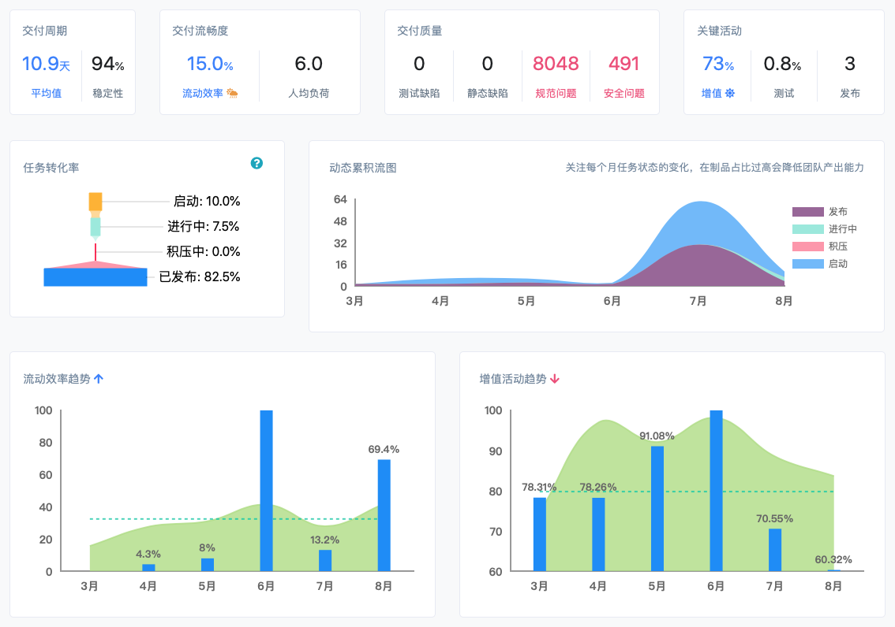

# X-Developer 文档

研发数据管理与效能洞察平台 :rocket::rocket::rocket: 使用说明

> X-Developer 是 **研发全生命周期的数据管理与效能洞察平台**，场量科技基于自动化和研发效能领域的技术能力与经验，完全自主创新、自主研发了这一平台级产品。我们的愿景是致力为您提供 **理念领先行业、技术自主可控的新一代研发数据分析工具。**

## 主要功能

X-Developer 定位于研发数据平台，主要功能是向 Git 仓库及其它三方研发工具（如 Jira、SonarQube、Tempo Timesheet 等）自动化地完成数据采集，通过我们自主研发的效能分析引擎，为您生成研发管理、项目管理、工程管理、质量管理等多维度的指标和分析报表。

## 2.0 新特性

更全面的数据、更丰富的指标、更合理的架构、更个性化的功能，以及行业级对标参照。

|<nobr>编号</nobr> |<nobr>特性</nobr> |<nobr>类别</nobr>  | <nobr>说明</nobr>|
|:---:| :--- | :---: | :---
|1|<nobr>开发者绩效分析<nobr>|功能|基于 11 组绩效指标，从日常纪律、效率、质量、贡献多个维度设计开发者绩效，自动化计算打分排名。 指标和分数均 **可通过模板进行分配**，帮助技术管理者灵活制定考核办法。|
|2|<nobr>[$X^d$ 行业指数](https://x-developer.cn/benchmark)</nobr>|<nobr>指标<nobr>|基于平台数据，我们首批推出了交付周期时间、任务流畅度、提交活跃度、加班指数、深夜加班指数、BUGS & FIX 指数六大指标，供您进行对比。|
|3|<nobr>[多源数据集成](https://x-developer.cn/integration/)</nobr>|<nobr>集成<nobr>|新增了 Jira、SonarQube、Tempo Timesheet 数据集成，满足企业对需求管理、代码质量和工时管理的数据分析要求。 **易使用：**用户仅需在 X-Developer 控制上进行简单的应用程序配置，即可将三方数据源整合到 X-Developer 分析项目中。 **可加工：**通过 X-Developer 平台，还可以对三方数据进行管理，包括状态映射、缺陷标注，以及静态分析结果筛选。|
|4|<nobr>新数据架构</nobr>|<nobr>架构<nobr>|基于 **时间跟踪（Time Tracking）** 和 **深度洞察（Deep Insights）** 理念设计了全新的数据架构，并对数据挖掘框架进行了全面重构，为研发效能度量建立起了一个稳定可扩展的设计范式。|
|5|<nobr>升级分析引擎</nobr>|<nobr>组件<nobr>|支持海量仓库和复杂触发时间规则，如定时执行、提交触发执行、强制分析、错锋分析等，X-Developer 提供了可配置的分析规则，帮助企业更好地利用CI/CD工具资源。|

更多功能细节请访问 [版本更新](updates) 说明页面。

## 如何使用

X-Developer 提供 SaaS 服务、私有部署两种模式，支持客户定制化开发。SaaS 模式下，您只需要注册帐号、完成购买，即可开始使用度量分析服务。如果您需要私有部署，我们会为您提供包含部署、安装、内部培训等支持。

### 1. 企业试用

X-Developer 仅为签订《产品试用协议》的企业提供试用。如果您有比选采购意向或内部尝试的兴趣，可在 [申请企业试用](https://x-developer.cn/request) 页面提交请求，我们会在两个工作日内与您商谈。

!> X-Developer 是商业产品，并且价格亲民，试用仅面向企业。如果您是个人用户，有使用或学习效能分析的需求，请选择直接购买，勿通过企业试用通道申请。我们可为您开具个人或企业抬头的发票。

### 2. 购买产品

#### 2.1 购买 SaaS 服务

X-Developer SaaS 服务采用预付费模式，订购成功之后，以下两个计时期间我们不会向您收取任何费用：

**接入期间：**直至您成功接入 X-Developer 至生成数据报表的期间，您的预付费用不会产生任何的变动。在此期间，您可以向我们反馈使用期间的问题，获得技术支持与帮助。

**调整期间：**完成接入并生成报表后，您仍有 7 天的免费期限用于对数据进行一些调整。例如，您可以选择一个小范围的团队进行试运行，对一些重名的开发者（他们可能被多计费）进行名称合并等，并对这些项目进行删除或重建，以使数据分析的价值最大化。

在 7 天的调整期间之后，我们会视为正式运行期，在每月底将对您的帐户进行费用扣除。

#### 2.2 购买私有部署版本

购买之前如有试用需求，请在 [申请企业试用](https://x-developer.cn/request) 页面提交请求，我们将先与您签订试用合同，并提供 2 个 SaaS 试用许可证和约定的试用期限供您内部测试。

产品采购之后，将按照正式的《产品技术服务合同》履行相关的权利责任。

### 3. 定制化开发

X-Developer 支持在基础版和专业版之上进行定制开发，并可基于 SaaS 或私有部署进行交付，其中 SaaS 交付模式仅收取适当的费用。

> **30 天交付承诺：**通常情况下，我们会在 30 天内发布定制化需求，如果是较大的需求，我们会进一步与您商讨交付时间点和细节。

## 需要支持

如果您需要任何帮助与支持，可通过产品内部的反馈功能提交，或直接联系我们：[support@withfield.tech](mailto:support@withfield.tech)

## 版权声明

 <a xmlns:dct="http://purl.org/dc/terms/" href="https://fieldtech.github.io/xdocs" property="dct:title" rel="dct:type">X-Developer 产品文档</a> 由 <a xmlns:cc="http://creativecommons.org/ns#" href="https://withfield.tech" property="cc:attributionName" rel="cc:attributionURL">场量科技</a> 采用 <a rel="license" href="http://creativecommons.org/licenses/by-nc-nd/4.0/">知识共享 署名-非商业性使用-禁止演绎 4.0 国际 许可协议</a> 进行许可。

 This work is licensed under a <a rel="license" href="http://creativecommons.org/licenses/by-nc-nd/4.0/">Creative Commons Attribution-NonCommercial-NoDerivatives 4.0 International License</a>.