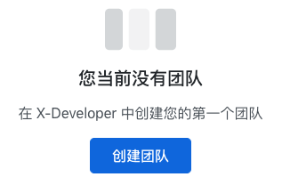

| :mega: :mega: :mega: |
| :----: |
| X-Developer 现已提供包括 GitHub、GitLab、Coding.net、TravisCI、Jenkins 等主流平台工具的集成支持。|

# 快速上手

> X-Developer 是构建在 DevOps、CI/CD 之上的研发效能度量工具，与代码提交流程无缝结合，利用无须人工干预的真实数据进行效率分析，帮助开发团队实现更加精益高效的旅程。

申请 X-Developer 帐号之后，您将进入工作台页面，在这里可以看到所有已创建项目信息，以及帐户、订单、积分、发票和API菜单入口。

## 使用流程

我们先熟悉一下它的使用流程，如下图所示，创建团队获得 API 信息后，完成对应 CI/CD 工具接入的配置，即可开启 X-Developer 自动化效能分析。


X-Developer 的手动分析功能，方便您利用手动生成的 Git 日志，快速进行效能分析试用。

## 创建团队

如果您是首次使用 X-Developer ，工作台默认会出现创建团队的提示。



完成团队创建后，将进入空白的团队界面，并提示您运行分析。


### 获得接入信息

进入 [API](https://x-developer.cn/accounts/api) 页面，您可以查看 `APPID` `APPKEY` 及已创建团队的 `TEAMID` 。

## 自动化分析

当前，X-Developer 提供了对 GitHub、GitLab、Coding.net、TravisCI 以及 Jenkins 等主流工具的集成。选择您使用的工具，参照以下说明文档进行配置接入：

- [GitHub](intergration/github.md)：最强大的在线代码托管平台
- [GitLab](intergration/gitlab.md)：绝大多数企业自建私有代码托管平台的首选
- [Coding.net](intergration/coding.md)：国产在线代码托管平台，提供私有部署
- [TravisCI](intergration/travis.md)：主流的持续集成云平台
- [Jenkins](intergration/jenkins.md)：主流的持续集成开源工具

如果您使用的工具未在此列，请在平台上提交反馈，或直接联系我们：[support@withfield.tech](mailto:support@withfield.tech)

## 手动分析

!> 此为可选项，适用于快速试用场景。

如果您对 Git 工具使用非常熟练，并希望快捷地尝试 X-Developer 分析功能，可以手动生成 Git 日志并运行手动分析，五分钟左右即可查看分析报告。

进入待分析的 Git 仓库，运行 Git 日志生成的命令如下：

```bash
git log --pretty=format:"%an,%ae,%ad,%s" >> commits.csv
```

选择“手动分析”，在弹出界面中选择您生成的日志 `commits.csv` ，再点击“查看报告”。


如果您的日志是从 `master` 导出，请勾选“Git仓库主干日志”，点击“查看报告”后，X-Developer 会启动分析。


## 查看报告

X-Developer 分析完成后，您将进入“概览”界面，向您呈现了项目的近期进展。


接下来您可以了解我们产品的 [核心优势](advantage) ，或 [常见问题](faq) 。