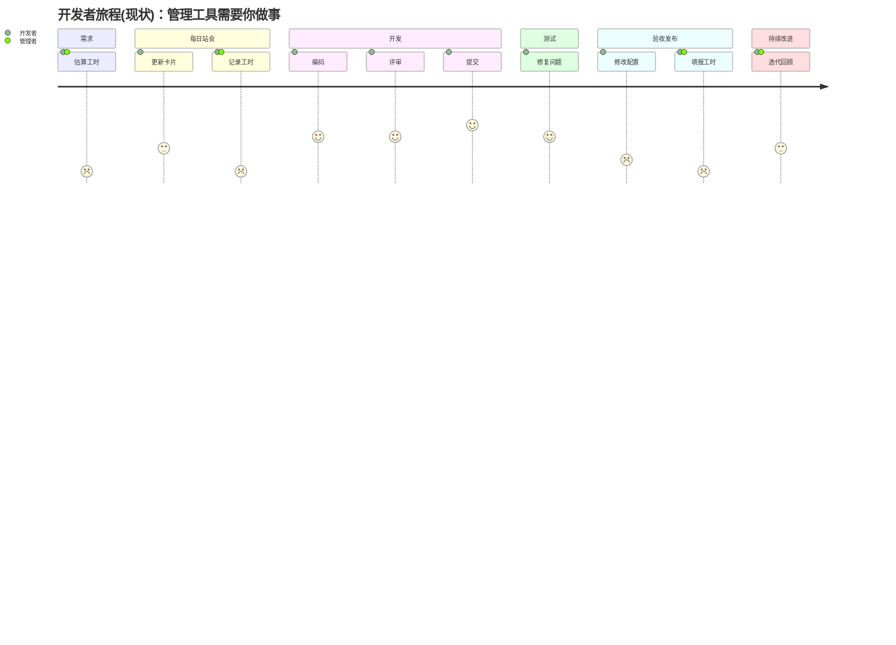
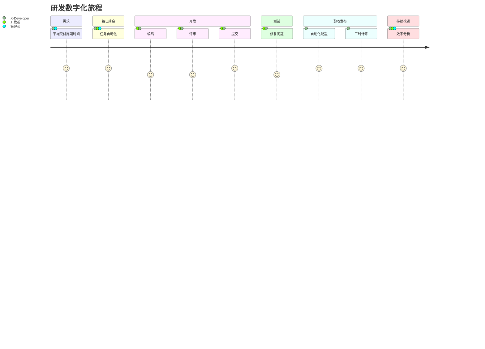

# 核心优势

!> 实施了管理工具，但没有提升效能？X-Developer 有哪些不同之处，能够帮助您的组织解决问题？

## 传统管理工具的劣势

我们使用用户旅程分析，来看一看传统管理工具模式下的开发者活动。

### 成本高

从上图分析可见，开发团队需要付出相当的成本，来满足管理的需要：

- 执行成本：缺乏使用工具的习惯，需要高层重视和定期督促
- 维护成本：开发团队日常需要频繁同步和维护任务状态，打断正常工作状态

### 效果差

传统管理工具达不到管理的效果，是因为：

- 信息维护不及时：导致管理人员无法及时发现偏差或风险，进度依然会失控
- 协作过程和结果不挂钩：出现问题难于找到原因，导致无法根绝问题，也就无法实现管理成果的达成

## X-Developer 核心优势

X-Developer 如何帮助组织简化成本、提升执行效果？这是新的开发者旅程：

与传统的管理工具相比，X-Developer 构建在 DevOps、CI/CD 平台工具基础之上，通过自动化和数据洞察能力，与开发流程无缝结合的运行模式，减轻了管理层与开发团队的负担，并且可以由结果层层回溯，找到问题根源，从而帮助组织实现降本增效的成果。

### 自动化

- 围绕 Git 提交流程，提供自动生成标准日志数据的工具，使基层活动可被量化
- 支持所有主流的 Git/CI 工具，实现开发过程自动化的数据采集，从而无须人工填报和干预
- 基于开发者提交活动，持续、自动化地完成管理所需的报告生成，让管理者随时可查看最新的一线活动

详细了解 X-Developer 的[自动化工作流程](guide?id=工作流程)。

### 数据驱动

- 基于机器学习、统计分析模型，对研发效能进行深入洞察，避免主观偏差
- 基于行为——结果关联性与目标差距分析，更高效地回溯问题和改进
- 作为事实数据平台，X-Developer 为组织展开更高层面（如人力资源、投资组合等）的管理提供了分析与决策的基础数据支撑