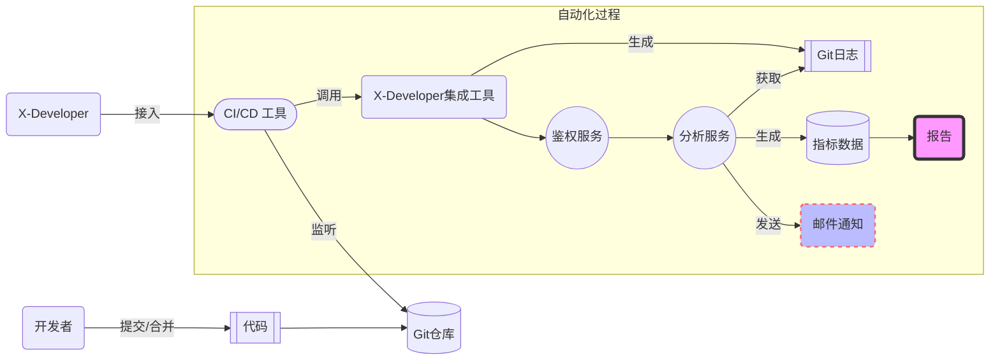

# 实时自动化度量

## 管理实践

DevOps 为组织构建了强大的 **业务连续性** 解决方案，包括文化、技能、范式与价值的闭环实践。X-Developer 围绕管理与优化、持续反馈环两大环节，整合敏捷、精益多项管理实践，构建了领先的研发数据度量体系。

### 管理与优化

> 如果你不能度量它，你就不能管理它。——德鲁克

X-Developer 的标准化流程和自动化过程，通过 **100 多个数据指标** ，帮助您实时监督和测量交付的实际情况，分析差异和问题，并从数据上追踪原因，从而避免进度风险，实现项目管理上的成功。

#### 工作量变化趋势

X-Developer 基于 Git 仓库提交记录，自动计算出团队/个人工作量及变化趋势，帮助您及时发现 **需求负荷合理程度** 以及 **忙闲不均** 的情况。

#### 交付效率变化趋势

X-Developer 提供需求和开发人员维度的 **平均交付周期时间** 自动化的计算与分析。通过这一指标，您可以获得项目整体的 **交付效率变化趋势** 。

#### 产能浪费比率

X-Developer 基于精益中的价值——浪费矩阵，对开发过程中的时间和活动进行分类，向您提供了 **交付流畅度** 和 **研发产能转化率** 分析报告。

#### 敏捷度分析

X-Developer 基于敏捷工程技术实践、开发者行为数据以及任务交付统计数据，向您提供了 **个人效率分析** 与 **协作效率分析** 雷达图。

#### 研发活动洞察

X-Developer 基于对代码提交的分类洞察，帮助您发现研发一线投入的分布，找到优化的目标与差距。

### 持续反馈环

> 传统的项目管理及协同工具需要人工填报数据，存在信息维护不及时、主观偏误等问题，导致管理人员无法准确地获得真实情况，向团队提供有效的反馈。

#### 缩短计划到执行的周期

X-Developer 通过自动化地处理任务状态更新、员工工作量记录并生成项目数据报告，大幅度节省人工填报和操作的时间，缩短计划到执行的周期。

#### 实时分析并生成反馈

基于机器学习和统计分析技术，X-Developer 提供了全面的数据量化指标，利用这些数据，团队可以实时地获得当前项目的真实情况，优化任务分配的工作节奏，使执行过程更加合理。

## 自动化流程

X-Developer 构建在 CI/CD 工具之上，为 DevOps 的持续管理优化、持续反馈环提供了无缝结合的集成方案，工作流程如下图所示。

### 代码变更过程中持续度量

传统模式下，开发团队通常是每周填写工时报告，或批量变更任务状态，这令管理层无法及时获得项目的真实进展。

新的模式下，开发团队提交代码时，CI/CD 流水线将自动触发 X-Developer 研发效能分析服务，分析结果将更新在指标数据库中，并生成实时报告，管理层可以随时查看到 **项目进度、任务状态以及人员效率** 的分析结果，极大地提升了研发的可见度和现场管理能力。