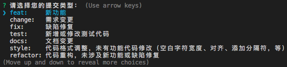

# 代码提交工具

X-Developer 提供了 [Simple Conventional Changelog](https://github.com/FieldTech/simple-conventional-changelog) 开源工具，帮助开发团队自动生成标准注释，描述了需求编号、提交类型和提交说明。如下所示：

```
#123 feat 中文交互式支持
```

## 环境

工具基于 `commitizen` 构建，需要搭建 [Node.js环境](https://nodejs.org/zh-cn/download/)。

## 安装

Node.js 环境准备好后，运行以下命令进行安装 `commitizen`。

```bash
npm install -g commitizen
```

进入您的 Git 仓库根目录，对于非 Node.js 项目，需运行以下命令创建 `package.json` 文件。

```bash
npm init --yes
```

生成之后的仓库文件目录示例：

```
repo
|__ package.json
```

## 配置

在 Git 仓库根目录下运行以下命令即启用规范，自动化地生成提交注释。

```bash
commitizen init @fieldtech/simple-conventional-changelog --save --save-exact
```

检查 `package.json` 可看到下面的生成项。

```json
{
    "config": {
        "commitizen": {
            "path": "./node_modules/@fieldtech/simple-conventional-changelog"
        }
    }
}
```

## 提交代码

在签入时，使用 `git cz` 来替代 `git commit` 提交代码。

```bash
git add .
git cz
```

随后您将看到交互式操作界面，根据提示即可完成规范的注释提交。



---

## 高级配置

可选项，配置键说明如下：

- maxHeaderWidth：注释行的最大长度
- defaultType：默认的提交类型
- defaultSubject：默认注释
- defaultIssues：默认任务编号

### 默认配置

```json
{
    "config": {
        "commitizen": {      
            "path": "./node_modules/@fieldtech/simple-conventional-changelog",
            "maxHeaderWidth": 100,
            "defaultType": "",     
            "defaultSubject": "",
            "defaultIssues": ""
        }
    }
}
``` 

## 参考

- [Conventional Commits 1.0](https://conventionalcommits.org)
- [commitizen](https://github.com/commitizen/cz-cli)
- [Simple Conventional Changelog](https://github.com/FieldTech/simple-conventional-changelog)