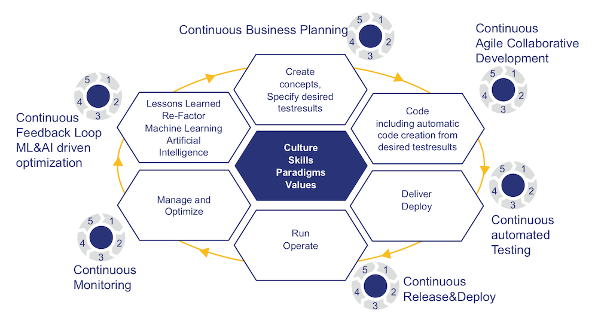
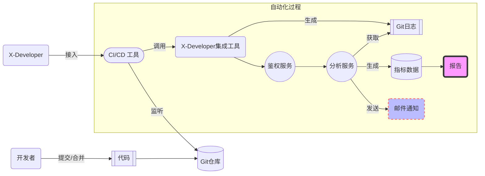

# 集成 DevOps 体系

DevOps 为组织构建了强大的 **业务连续性** 解决方案，包括文化、技能、范式与价值的闭环实践：

- 持续的业务规划：构建概念和特定的预期实验结果
- 持续的敏捷协作式开发：编写或自动生成符合预期实验结果的代码
- 持续的自动化测试：交付和部署
- 持续的发布和部署：运行与维护
- 持续的监控：管理与优化
- 持续的反馈环和智能优化：基于机器学习和 AI 技术进行积累和重构

X-Developer 围绕 **持续监控与反馈** 两大环节，聚焦研发组织的管理优化与改进提升，整合敏捷、精益实践，构建了领先的研发数据度量体系。

## 管理优化

> 如果你不能度量它，你就不能管理它。——德鲁克

X-Developer 的标准化流程和自动化过程，通过 **100 多个数据指标** ，帮助您实时监督和测量交付的实际情况，分析差异和问题，并从数据上追踪原因，从而避免进度风险，实现项目管理上的成功。

### 工作量

基于团队/个人工作量及变化趋势，帮助您及时发现 **需求负荷合理程度** 以及 **忙闲不均** 的情况。

### 响应力

基于需求和开发人员维度的 **平均交付周期时间** ，您可以获得项目整体的 **响应力变化趋势** 。

### 吞吐率

基于需求和开发人员维度的 **在制品数量** ，您可以获得项目整体的 **吞吐率变化趋势** 。

### 浪费

基于精益中的 **价值——浪费矩阵**，对开发过程中的等待时间和活动进行分类，向您提供了 **交付流畅度** 和 **研发产能转化率** 分析报告，帮助您找到优化空间。

### 敏捷度

基于敏捷工程技术实践、开发者行为数据以及任务交付统计数据，向您提供了 **个人效率分析** 与 **协作效率分析** 雷达图。

### 活动成本

基于对研发活动耗时的分类洞察，帮助您发现研发一线投入的分布，快速进行人效盘点和项目活动成本归集。

## 持续反馈环

> 传统的项目管理及协同工具需要人工填报数据，存在信息维护不及时、主观偏误等问题，导致管理人员无法准确地获得真实情况，向团队提供有效的反馈。开发人员在沟通上的个体差异性，也令管理层在信息交流和绩效判断上，存在着偏差。

X-Developer 通过自动化的数据采集、分析与结果生成，节省团队时间的同时，也面向管理层和开发团队提供了双向的反馈。

### 减少无谓的进度沟通会议

项目进度、任务状态自动更新，无须占用开发团队时间，管理层即可实时获得进度状态，把精力更多的放在解决障碍上。开发团队可以利用实时数据，及时调整任务计划，合理利用工作时间，提升团队产出。

### 对工作过程达成一致的理解

在工作量、响应力、浪费及敏捷度分析上通过趋势与均值的量化对比分析，帮助管理层与开发团队对现状趋势、个人及团队表现，以及改进方向达成一致理解。

### 对工作结果实现平等的评价

实时与周期性报告结合，既反映开发人员习惯，也能综合阶段性交付结果的比较，排除了个体沟通交流的差异，让开发人员用实际贡献说话。

## 自动化集成

X-Developer 构建在 CI/CD 工具之上，为 DevOps 的持续监控与反馈提供了无缝结合的集成方案，工作流程如下图所示。

### 无须编写任何代码

传统的 BI 类系统要求您投入大量的数据采集和二次开发工作，至少需要数周甚至数月才能看到数据，浪费大量的人力、财力和物力，关键是，这样的项目开发方式本身就已经不适合 DevOps 时代了。

X-Developer 结合 CI/CD 工具的工作模式，**仅需五分钟配置，**即可生成所有您所需要的报告。

### 代码变更过程中持续度量

传统模式下，开发团队通常是每周填写工时报告，或批量变更任务状态，这令管理层无法及时获得项目的真实进展。

新的模式下，开发团队提交代码时，CI/CD 流水线将自动触发 X-Developer 研发效能分析服务，分析结果将更新在指标数据库中，并生成实时报告，管理层可以随时查看到 **项目进度、任务状态以及人员效率** 的分析结果，极大地提升了研发的可见度和现场管理能力。