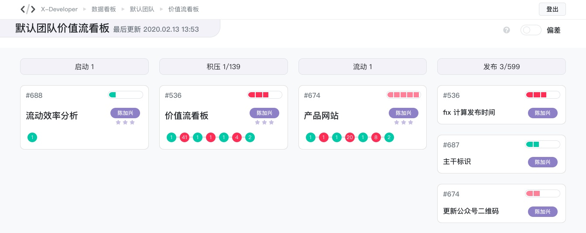
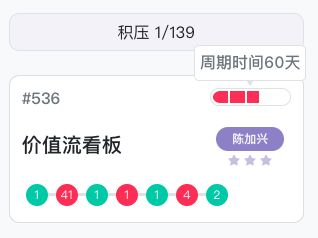
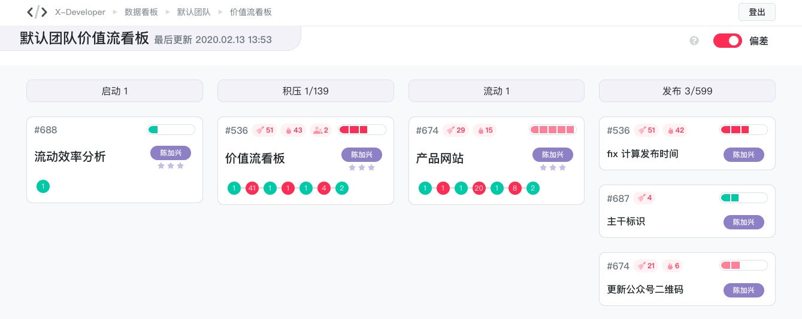
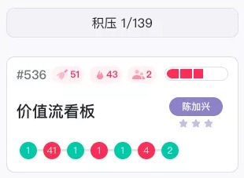

# 自动化看板应用

X-Developer 基于数据与自动化处理能力为您提供了一个强大的项目管理工具：自动化看板 :beer::beer::beer:

传统的看板管理工具，需要您手动地更新任务状态，提醒开发人员及时维护任务，已经成了许多组织的管理痛点。

现在有了 X-Developer 整体解决方案，我们可以很高兴地对这些额外的工作 SAY 886 了:tada::tada::tada:

> 我们的目标：Commit once, automatic everything everywhere! :rocket::rocket::rocket:

## 看板内置泳道规则

X-Developer 的看板内置了“启动—积压—流动—发布”四条泳道，任务卡片通过以下规则自动化地归集到对应的泳道上：

- **启动：**两个工作日内，只有第一次提交的任务卡片。
- **积压：**已启动，但近两个工作日内没有提交活动的卡片。
- **流动：**已启动，近两个工作日内有提交活动的卡片。
- **发布：**已合并到主干/发布分支上的卡片。

## 卡片上的信息

每个卡片上有丰富的图例信息，全部通过数据计算完成。

右上角的进度条，展示团队任务交付的**平均周期时间**。

进度条的颜色和比例，分别用绿色、粉色和红色显示**正常、超期和严重超期** 状态。

看板实践，倡导加速流动，这背后的原理除了控制在制品数量，就是尽可能地缩短周期时间。X-Developer的卡片进度条，直观地向团队呈现了**周期时间的偏离情况**。鼠标移动到进度条上，即可查看该卡片的周期时间。

卡片底部的数字序列，展示的是进展详情。绿色代表持续流动的天数，红色则代表浪费的天数，它向团队呈现了**任务的流畅度**，帮助团队成员更好地提升任务专注度。

### 还有彩蛋:egg::egg::egg:

- 对超过三周的积压卡片，看板将自动将卡片回收，在泳道上显示统计数字
- 对超过两周的发布卡片，看板也通过自动回收的方式显示统计
- 论无论卡片是处于积压还是发布状态，只要有新的提交，它都将自动出现在“流动”泳道，表明它又开始了新的工作

是不是很像垃圾回收器？在管理数字化时代，X-Developer 利用计算机思维，最大限度地减少重复的人工工作，解放开发人员的大脑。

## 与敏捷实践结合

有了这个强大的自动化看板，您的团队可以轻松地实现敏捷管理的自动化。从每日站会到团队回顾，您需要的，X-Developer 都想到了。

### 单一 Backlog :bookmark:

DevOps流水线即时触发的数据采集，帮助您完成项目和迭代进度的每日更新。X-Developer 的强大之处在于，可以把分布式团队的活动、组件化模块架构，集中整合为一个集中的项目可产品团队状态看板。在敏捷最佳实践中，它又称之为单一 Backlog 实践。

> 敏捷技术实践中，倡导微服务架构、小型的支持快速发布的组件组件化架构。现行的任务管理系统，无论是 GitHub/GitLab 自带的Issue看板，还是Jira的 Scrum/Kanban，在产品和大项目协同中，都无法进行顶层管理，看到进度全貌。

X-Developer 支持多种组织架构下产品、团队、项目等不同的运作模式（参考：[不同组织结构的应用](dem/structure) ）。通过简单的数据源配置，一个产品，可集成多个团队，一个团队，可集成多个项目/仓库，每层都可以看到该整合维度的视图。

我们来看看如何利用 X-Developer 进行敏捷项目管理。

### 每日站会 :speech_balloon:

自动化看板，完美地支持了每日站会团队状态同步。每张卡片的进度条和进展统计，向团队呈现了进度风险。

滑动打开看板右上侧的“偏差”按钮，即可看到每张卡片的进度风险详细情况。

偏差与进展的统计情况，可以帮助团队在迭代回顾会议，进行审视和改进。

### 迭代发布 :checkered_flag:

迭代发布之后，X-Developer 会自动完成卡片的统计与更新，并统一呈现在“发布”泳道上。运营团队可以根据这些信息，快速地展开GTM（Go to marketing）的各项工作。

> 产品经理再也不用在迭代的最后一天疯狂地拖拽卡片了！

把管理工作自动化，听起来是不是很惊奇呢？赶紧行动起来吧！:rocket::rocket::rocket: