# 组织结构关注点

在 X-Developer 中创建一个度量分析项目后，即建立了一个效能管理单元。

> 效能管理单元为 X-Developer 数据采集、分析的最小聚合地，一个效能管理单元可以对应多个代码仓库，方便您将多个产品和项目的开发人员数据组织在一起。

根据组织结构的特点，您可以选择基于产品、项目或团队来进行效能分析，在 X-Developer 中，通过对 Git 仓库配置的连接，完全能够实现灵活的分析，而无须担心组织架构或项目的变化导致数据工作推倒重来。

## 固定团队结构

如果您希望针对不同的部门、团队或开发小组进行效能分析，这些组织内的人员通常也不会流动，可以将 X-Developer 的分析项目等同于您的组织结构中的最小团队单元。如下所示，五位开发人员分别属于不同的团队，之间没有角色权限的交集，在代码管理上也是隔离的。

运行分析后，您将在团队内部看到每位开发人员的效能数据。

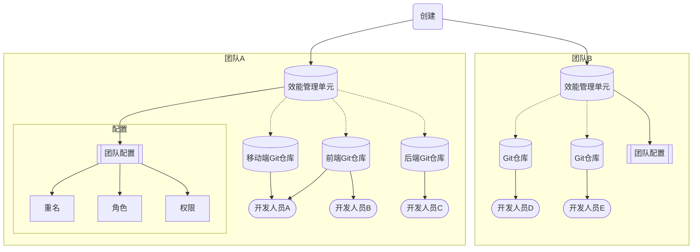

### 管理优化

针对固定团队结构，X-Developer 的报告需要您重点关注的是：

#### 团队和成员工作量

成员投入是否合理？是否超过负荷？是否忙闲不均？工作分配是否合理？

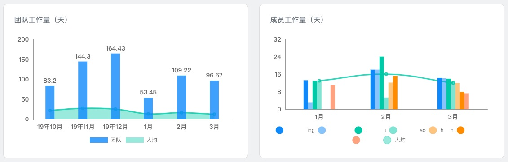

#### 研发浪费分析

有效产出的比例？存在多少浪费？优化空间和方向？

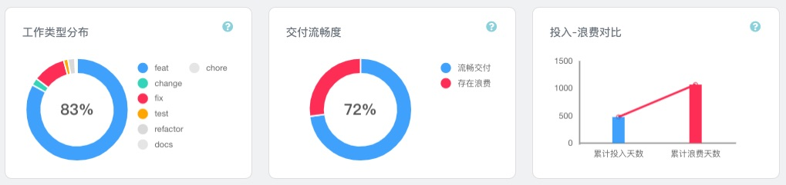

#### 开发人员效率分析

包括个人效率与协作效率，哪些方面是突出贡献？哪些方面有待优化？

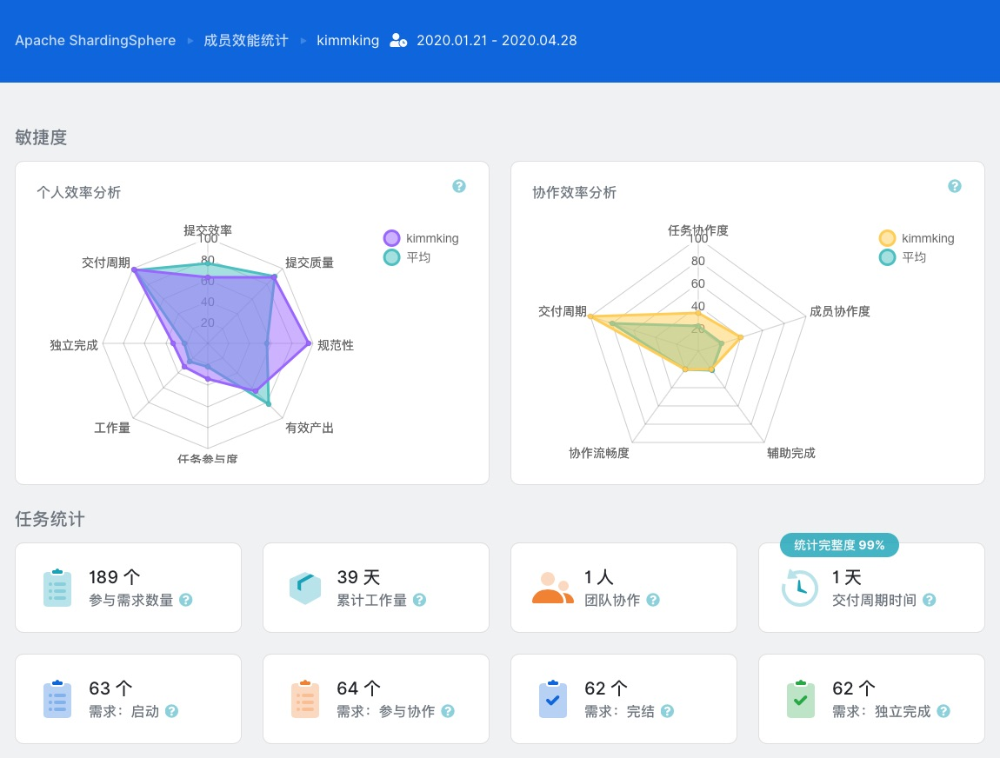

## 产品团队结构

以产品为中心的组织，如果采取固定资源组织模式，可直接使用 [固定团队结构](dem/structure?id=固定团队结构) 的方式创建分析项目。

如果存在共享资源，每个产品都可能会跨团队协同，您希望分析每个产品之间的研发效能表现差异，那么在 X-Developer 中创建的分析项目应该对应为您的产品名称。如下所示，五位开发人员工作在两个产品上。

运行分析后，社交产品将会包括 **开发人员A、B、C、D** 的分析数据，工具产品将会包括 **开发人员A、B、E** 的数据。相应的，开发人员的效能数据也会显示两个产品的分析结果，在组织维度上，您可以查看开发人员的汇总效能分析数据。

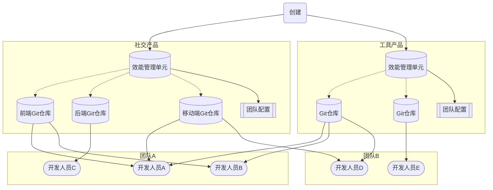

### 管理优化

!> 跨产品工作和跨团队的协作会带来一定的沟通成本和等待，所以在这种组织结构下 **研发浪费** 不是主要的关注点。

针对产品制组织结构，X-Developer 的报告需要您重点关注的是：

#### 总工作量和人均工作量趋势

检查产品需求的波动性和可持续性，及时地对投入人员的工作进行分担或合并，提高应对变化的响应力。

- 总工作量增长，人均工作量下降时，需关注成员是否负荷了较多的关行工作，需提升专注程度，如减少手头负责产品的数量，固定交付某个产品的功能。
- 总工作量增长，人均工作量增长时，需关注近期是否有严重超负，考虑增加人手，合理调岗轮休。同时关注交付质量与团队稳定性，适当调整开发关注点，防止人员流失。

一个稳定上升的产品通常的数据表现如下图 `Apache ShadringShpere` 数据所示，工作量稳中有升，人均投入非常稳定。

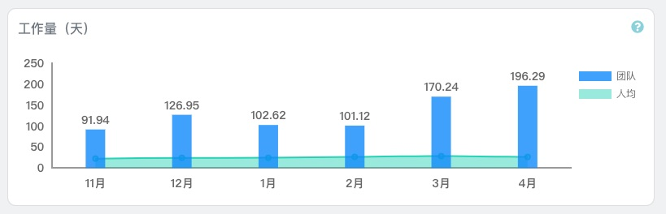

#### 团队结构稳定性

跨团队的产品工作具有灵活性，也在组织范围内共享了开发资源，但业务知识需要长期积累才能保证产品交付的效率和质量。团队结构是否保持稳定性，也是产品组织结构的关注点。

以下是 `Apache ShadringShpere` 团队同时期的总工作量环比、同比与人员结构分布，可以看到，在快速增长的同时，稳定的人员（蓝绿色部分）占据绝大多数。

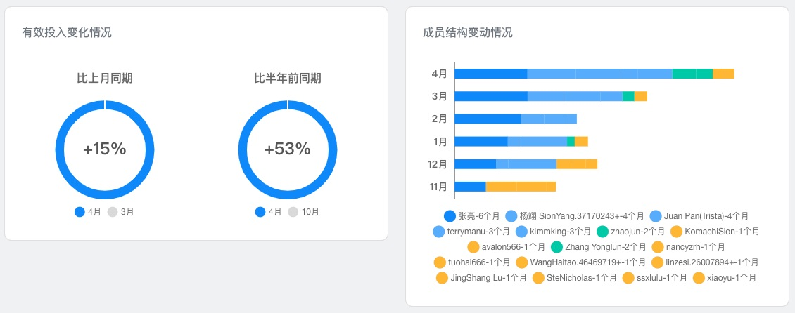

以下以 `Apache Dubbo` 举例说明人均投入较不稳定，在 11 月有显著的下降，需关注是否有人员变动或其它异常情况。

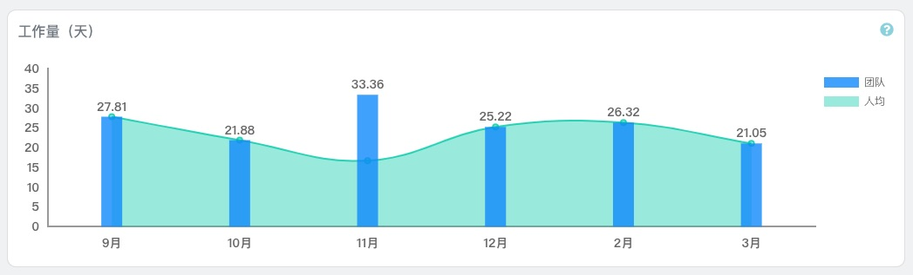

下图说明总工作量同比和环比均有较大下滑，产品的可持续性出现较大挑战，通常也面临着大量的人员流失。

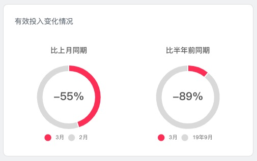

#### 交付周期时间

交付周期时间是从开发人员针对某项需求或任务初始提交直至该任务被合并到主干发布的合并时间之间的自然日。

产品驱动的组织关注的是面市时间（Time to Market），而交付周期时间反映了这个过程中研发团队的效率表现。

下图 X 轴为需求/任务的编号，Y 轴为交付周期时间，水平虚线为平均交付周期时间。

!> 需要重点关注的是超过平均交付周期时间的需求/任务，及时推动障碍解决。

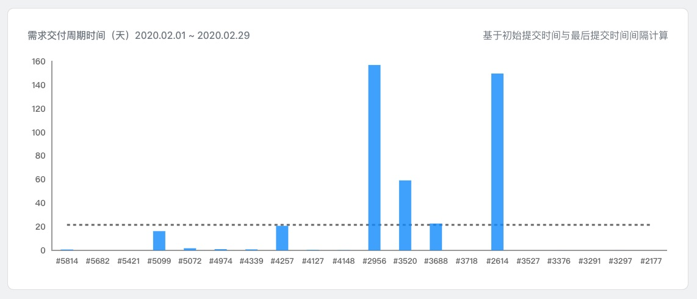

## 项目团队结构

如果您的组织是项目制，会经常灵活地调配开发人员，项目也有一定的生命周期，您只需要以项目为单位创建分析项目，然后连接对应的 Git 仓库即可，X-Developer 基于 Git 仓库的事实数据分析，能够动态地适配人员变化，提供了完美的效能跟踪支持。

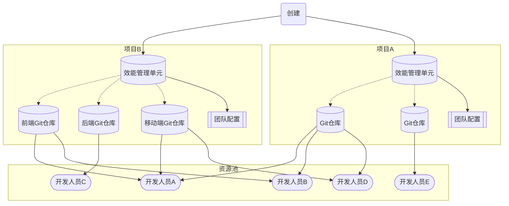

### 管理优化

针对项目团队结构，X-Developer 的报告需要您重点关注的是：

#### 项目统计

在项目统计模块里，提供了累计人员投入数量/工时、平均交付周期时间、项目成本结构以及项目产能转化率数据。下图是 `Apache ShardingSphere` 项目统计。

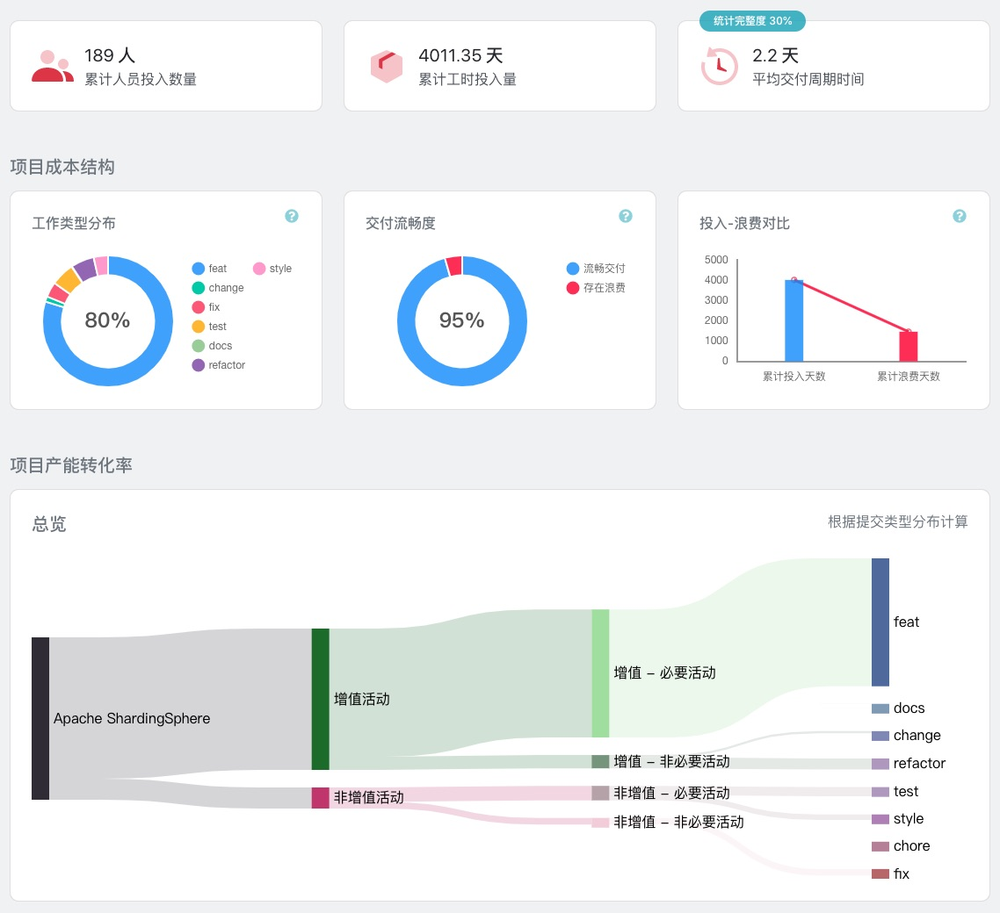

#### 看板

X-Developer 的看板为您提供了自动化、实时的项目进度和任务状态跟踪。

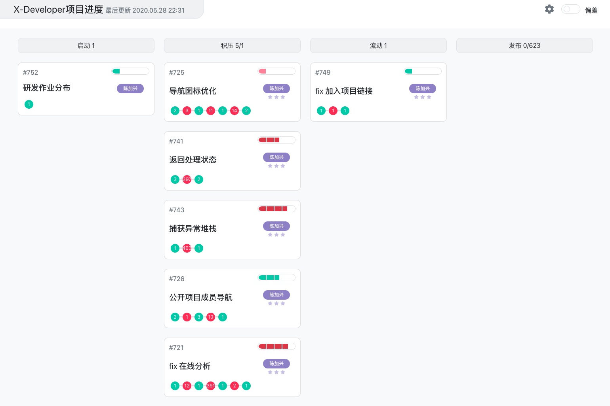

#### 开发资源库

X-Developer 为您提供了组织级的开发资源库，您可以通过资源库寻找合适的开发人员，以优化您的项目交付收益。

- 持续有着高贡献的开发人员：组织重点项目交付工作
- 近期工作量负荷下降的开发人员：在需求增加的项目间人员调配
- 新加入组织的开发人员：为压力较小的项目进行人员培养与储备