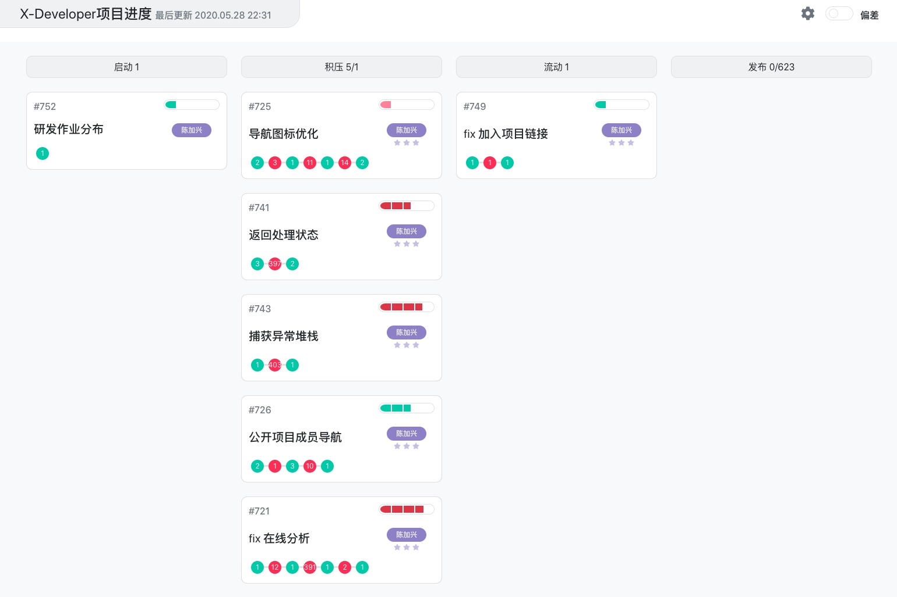
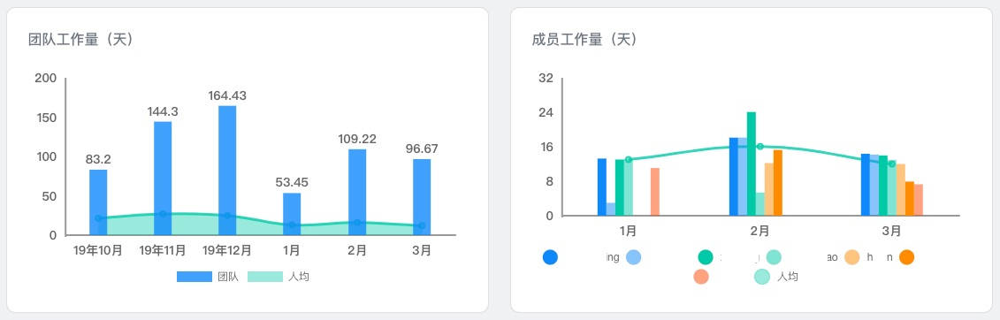
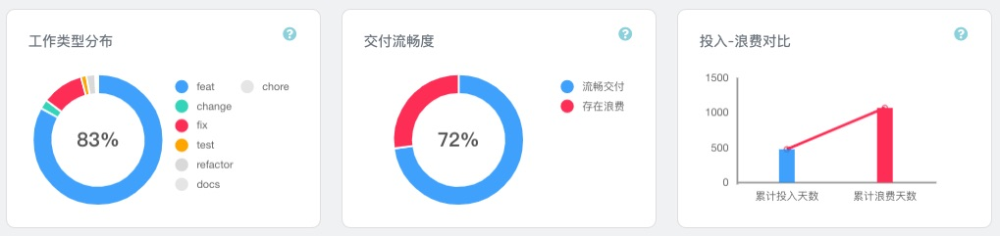

# 团队效能管理

基于您的组织结构特点（参考：[不同组织结构的应用](dem/structure) ）创建并配置 Git 仓库，完成分析后，您将在工作台上看到团队卡片，以下以 `Apache ShardingSphere` 开源项目分析数据为例。

- 卡片上的 **成员** 为团队中的开发人员，带颜色和首字母的为最近6位活跃的开发人员，最后的数字表示未显示的开发人员总人数。
- 卡片的底部列出了三个值得关注的 **数据指标**：进行中的任务数量、最近一个月发布的任务数量和平均交付周期时间。

团队效能度量包括 **概览、开发者、看板、效能趋势、项目统计、改进目标** 几大功能模块，以数据面板的形式向管理层及开发团队呈现量化结果。

在团队配置中，X-Developer 提供了 **开发人员姓名除重、离职名单管理以及角色权限管理** 功能。

## 概览

全方位地展示团队的现状。包括最新进展、活跃开发者、提交活动分布、工作量、任务转化率、动态累积流图、任务并行度和平均交付周期时间趋势。

## 开发者

管理和查看团队中所有的开发人员效能分析数据。

## 看板

X-Developer 提供了自动化的看板，来展示项目的进度和任务的状态细节（参考：[自动化看板应用](dem/kanban) ）。

## 效能趋势

通过交付周期时间、有效投入、效率分析、质量分析、团队稳定性几个维度，帮助您掌握团队的表现趋势。

## 项目统计

提供了人员投入、工作量投入、平均交付周期时间、工作类型分布、交付流畅度、投入—浪费分析以及产能转化率分析。

## 改进目标

基于提交效率、注释规范性、工作量稳定性和工作习惯进行现状诊断和差距分析，生成评估报告，供您定期查阅和关注。

