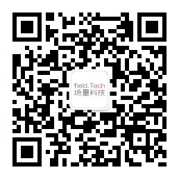

## 了解场量

作为一家创新型公司，我们开发了全球第一款事实数据型研发效能度量分析平台 [X-Developer](https://x-developer.cn) 。

使用我们的平台与开源工具，无需购买、设置或管理任何基础设施，您只需登录即可开始开展研发团队效能改进工作。

目前，X-Developer提供了最便捷、完整的研发效能度量解决方案，让您能够以开发者为中心展开改进活动，使您的团队能够围绕目标协同工作，及时同步项目进展，从而将他们从繁重的任务状态维护、项目报告工作中解放出来，集中精力完成研发工作，更好地编写代码，提高业务获得的价值。

## 经验背景

核心团队拥有超过10年的研发效能领域经验，为多家世界500强企业、创新型科技公司以及开源组织提供研发效能领域的服务，包括通信、银行、保险、电力、能源、软件服务等多个领域，我们的产品构建在这些深入的经验积累与洞察之上，并完全自主研发。我们主导的项目包括：

### 华为IT持续集成云平台

设计研发了国内首个支持万人规模的 Cloud CI 平台。

在 2015 年，我们就通过领先的 **微服务 + 容器化 + 流水线编排** 思想，设计了远超当时 OpenStack Jenkins（基于分布式消息队列）和 CloudBee（基于NFS）以及 eBay（基于Mesos）的大规模持续集成技术方案。

我们设计的 Cloud CI 平台支持超过 7000 次日构建，并完成了复杂的企业级构建集成与部署支持：

- J2EE、Python、Ruby、iOS、Android 等主流开发技术栈
- Oracle EBS 企业级应用，包括数据库集成
- WebShpere、Apache、Tomcat 部署
- Spring Boot 微服务部署

### 招行精益看板应用

国内首个基于研发过程数据度量进行效能改进的案例。我们通过对需求变化率、团队结构以及可视化浪费的分析，帮助试点团队取得 **超过80%** 的流动效率提升。在此项目中，我们展示了：

- 如何基于需求的变化率选择合理的开发过程模型
- 合理的团队结构中人员如何配置
- 需求规模大小与项目浪费的关系
- 特性 - 任务闭环的精益度量模式

## 公开资源

我们提供了知乎专栏 [研发效能](https://zhuanlan.zhihu.com/field-tech) 为您分享行业趋势与洞见。另外，您还可以通过微信公众号、头条号阅读最新的文章。

 

## 联系方式

除通过公开渠道给我们留言之外，您还可以通过邮件与我们直接联系：[support@withfield.tech](mailto:support@withfield.tech)