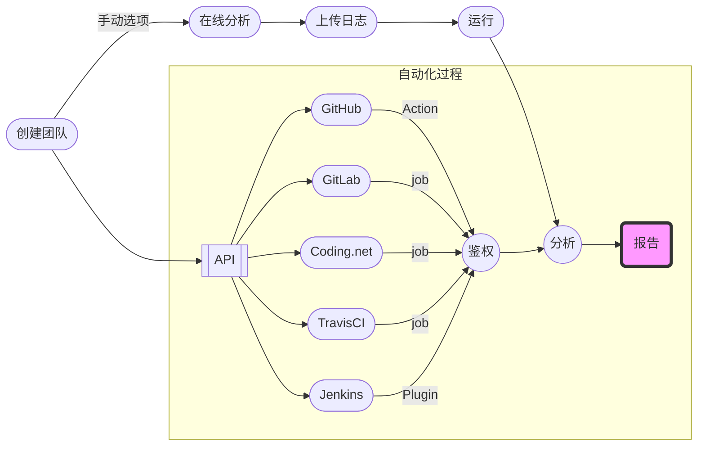

# 快速上手

> X-Developer 是构建在 DevOps 之上的研发效能度量工具，与代码提交流程无缝结合，实现无须人工干预的真实数据效率分析。

## 工作流程

如下图所示，创建团队后可选择手动在线分析或 API 集成 CI/CD 工具自动化效能分析，最终生成度量报告。



## 创建团队

如果您是首次使用 X-Developer ，工作台默认会出现创建团队的提示。


完成团队创建后，将进入空白的团队界面，并提示您运行分析。


## 手动分析

!> 适用于基础版用户。

手动分析模式下，需要您自行生成 Git 日志。进入待分析的 Git 仓库，运行 Git 日志生成的命令如下：

```bash
git log --pretty=format:"%an,%ae,%ad,%s" >> commits.csv
```

选择“手动分析”，在弹出界面中选择您生成的日志 `commits.csv` ，再点击“查看报告”。


如果您的日志是从 `master` 导出，请勾选“Git仓库主干日志”，运行“查看报告”。


## 自动化分析

!> 适用于专业版及企业版用户。

X-Developer 提供了对 GitHub、GitLab、Coding.net、TravisCI 以及 Jenkins 等主流工具的集成。选择您使用的工具，参照以下文档配置接入：

- [GitHub](intergration/github.md)：最强大的在线代码托管平台
- [GitLab](intergration/gitlab.md)：绝大多数企业自建私有代码托管平台的首选
- [Coding](intergration/coding.md)：国产在线代码托管平台，提供私有部署
- [TravisCI](intergration/travis.md)：主流的持续集成云平台
- [Jenkins](intergration/jenkins.md)：主流的持续集成开源工具

工具接入所需的身份验证及团队信息可在 [API](https://x-developer.cn/accounts/api) 页面查看。

如果您使用的工具未在此列，请在平台上提交反馈，或直接联系我们：[support@withfield.tech](mailto:support@withfield.tech)

## 查看报告

X-Developer 分析完成后，您将进入“概览”界面，向您呈现了项目的近期进展。


