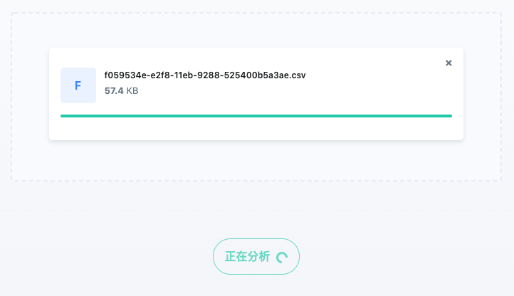
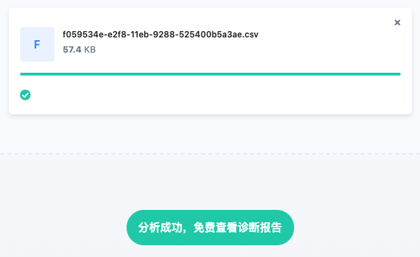

# 快速上手

> X-Developer 是研发全生命周期的数据管理与效能洞察平台，我们基于在自动化和研发效能领域的技术能力与经验，完全自主创新、自主研发了 X-Developer 平台，致力为您提供理念领先行业、技术自主可控的新一代研发数据分析工具。

## X-Developer 提供什么功能？

作为数据类产品，X-Developer 提供的功能是向 GIT 仓库及其它三方研发工具（如 Jira、SonarQube、Tempo Timesheet 等）自动化地完成数据采集，通过我们自主研发的效能分析引擎，X-Developer 最终为您生成研发管理、项目管理、工程管理、质量管理等多维度的指标和分析报表。


## X-Developer 体验流程

X-Developer 提供了“免费诊断”帮助您获得第一份研发效能分析报告，无论注册用户还是访客，均可以使用免费诊断功能。

如果您是首次使用 X-Developer ，请确保您会操作 Git 命令行以生成一份日志，以用于执行数据分析。

进入待分析的 Git 仓库，运行 Git 日志生成的命令如下：

```bash
git log --pretty=format:"%an,%ae,%ad,%s" >> commits.csv
```

进入 [免费诊断](https://x-developer.cn/discovery/) 将您生成的日志 `commits.csv` 拖入文件区域，分析将自动启动。


根据日志文件的大小，您需要等待一至五分钟。



分析完成后将看到查看按钮。



## 团队洞察报告

在这份报告中，X-Developer 向您展示了团队相关的指标和行业对比。


> 这只是免费体验的beta版本，我们会不断推出更多的免费体验报告指标。

## 您还可以免费查看 $X^d$ 指数

基于平台数据生成的 [$X^d$ 指数](https://x-developer.cn/benchmark)，首批推出了交付周期时间、任务流畅度、提交活跃度、加班指数、深夜加班指数、BUGS & FIX 指数六大指标，供您进行对比。