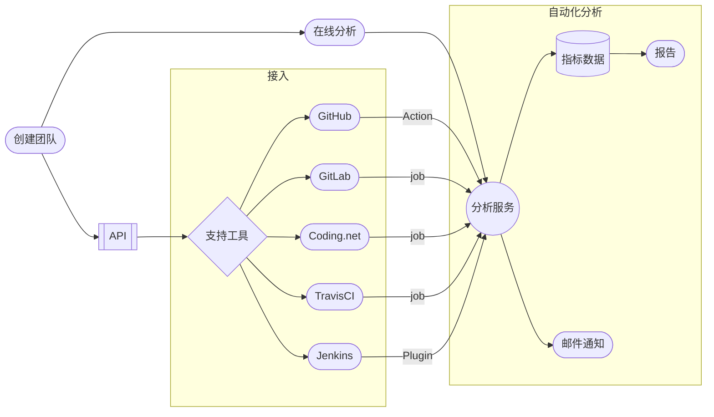
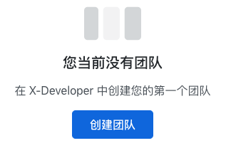
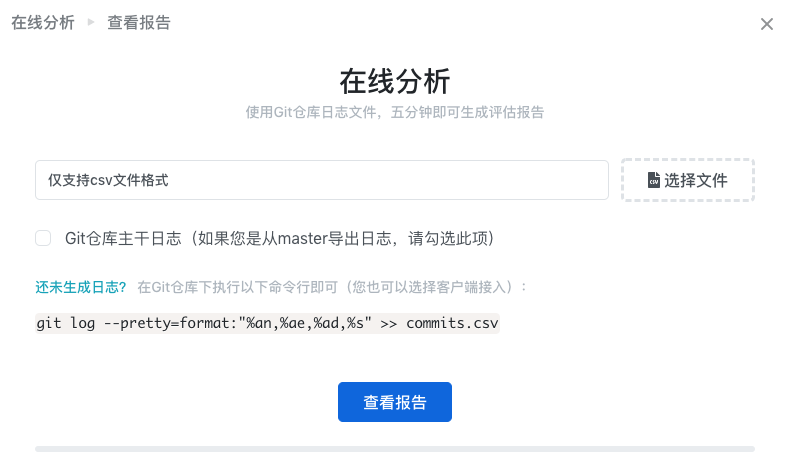
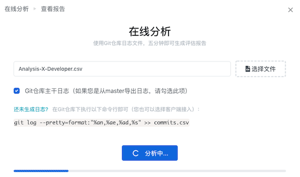
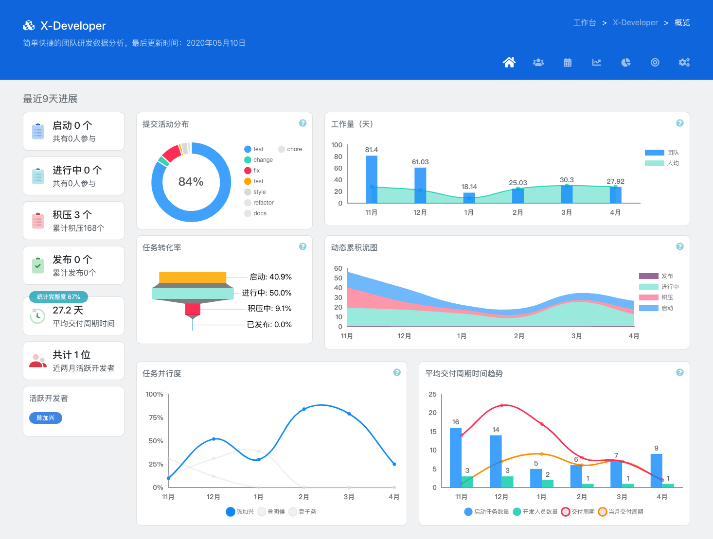

# 快速上手

申请 X-Developer 帐号之后，您将进入工作台页面，在这里可以看到所有已创建项目信息，以及帐户、订单、积分、发票和API菜单入口。

## 工作流程

在使用 X-Developer 之前，我们先熟悉一下它的工作流程，如下图所示。

您需要创建一个团队，并完成接入的配置。当前，X-Developer 提供了对 GitHub、GitLab、Coding.net、TravisCI 以及 Jenkins 等主流工具的集成：

- [GitHub](intergration/github.md)
- [GitLab](intergration/gitlab.md)
- [Coding.net](intergration/coding.md)
- [TravisCI](intergration/travis.md)
- [Jenkins](intergration/jenkins.md)

如果您使用的工具未在此列，请在平台上提交反馈，或直接联系我们：[support@withfield.tech](mailto:support@withfield.tech)

!> X-Developer 也提供了在线分析功能，方便您进行尝试，但它是手动的，不适合持续的分析。

## 创建团队

如果您是首次使用 X-Developer ，工作台默认会出现创建团队的提示。

完成团队创建后，将进入空白的团队界面，并提示您运行分析。

### 获得接入信息

进入 [API](https://x-developer.cn/accounts/api) 页面，您可以查看 `APPID` `APPKEY` 及已创建团队的 `TEAMID` 。

## 在线分析

如果您对 `Git` 使用非常熟练，并希望快捷地尝试 X-Developer 分析功能，可以使用在线分析，使用您自行准备的日志，五分钟左右即可查看分析报告。

选择“在线分析”，在弹出界面中选择您生成的日志，再点击“查看报告”。

如果您的日志是从 `master` 导出，请勾选“Git仓库主干日志”，点击“查看报告”后，X-Developer 会启动分析。

## 查看报告

X-Developer 分析完成后，您将进入“概览”界面，向您呈现了项目的近期进展。

