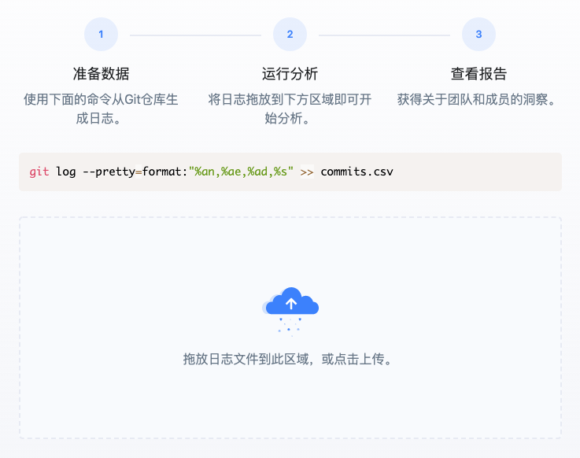
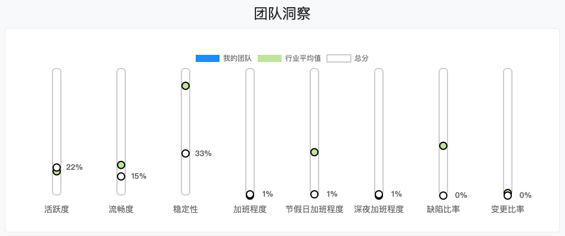

# 快速体验

> X-Developer 提供了一个免费的 Git 日志分析工具，帮助您在五分钟之内了解一线代码仓库活动情况。

如果您是首次使用 X-Developer ，请确保您会操作 Git 命令行，用于生成执行数据分析的日志文件。

### 第一步：生成日志

进入待分析的 Git 仓库，运行如下命令：

```bash
git log --pretty=format:"%an,%ae,%ad,%s" >> commits.csv
```
### 第二步：使用日志进行分析

进入 [Git日志分析工具](https://x-developer.cn/analysis/git) 将您生成的日志 `commits.csv` 拖入文件区域，分析将自动启动。



根据日志文件的大小，您需要等待一至五分钟。

### 第三步：完成分析

分析完成后将看到查看按钮，点击即可查看诊断报告，X-Developer 向您展示了团队相关的指标和行业对比。



### 行业指数

V2.0 版本，我们基于平台数据生成 [$X^d$ 指数](https://x-developer.cn/benchmark)，首批推出了交付周期时间、任务流畅度、提交活跃度、加班指数、深夜加班指数、BUGS & FIX 指数六大指标，供您进行对比。
