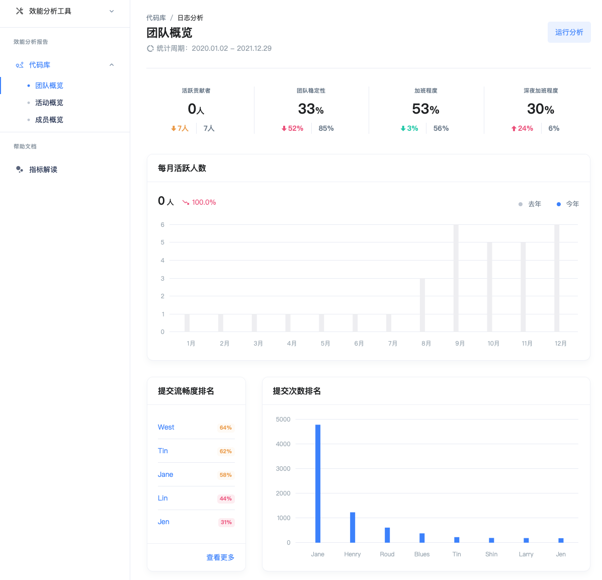

# 快速体验

> 2021年7月，我们基于市场需求，正式发布了 **X-Developer V2.0 版本**，包括 T 型数据架构、多源数据集成、开发者绩效分析，$X^d$ 行业指数等全新特性，帮助客户更好地利用数据，提升内部研发管理能力。

## 体验流程

X-Developer 提供“免费诊断”帮助您获得第一份研发效能分析报告。无论注册用户还是访客，均可以使用免费诊断功能。

!> 如果您是首次使用 X-Developer ，请确保您会操作 Git 命令行，用于生成执行数据分析的日志文件。

### 第一步：生成日志

进入待分析的 Git 仓库，运行如下命令：

```bash
git log --pretty=format:"%an,%ae,%ad,%s" >> commits.csv
```
### 第二步：使用日志进行分析

进入 [免费诊断](https://x-developer.cn/discovery/) 将您生成的日志 `commits.csv` 拖入文件区域，分析将自动启动。


根据日志文件的大小，您需要等待一至五分钟。


### 第三步：完成分析

分析完成后将看到查看按钮，点击即可查看诊断报告。


## 诊断报告

在这份报告中，X-Developer 向您展示了团队相关的指标和行业对比。



> 这只是免费体验的beta版本，我们会不断推出更多的免费体验报告指标。

## 行业指数

V2.0 版本，我们基于平台数据生成 [$X^d$ 指数](https://x-developer.cn/benchmark)，首批推出了交付周期时间、任务流畅度、提交活跃度、加班指数、深夜加班指数、BUGS & FIX 指数六大指标，供您进行对比。