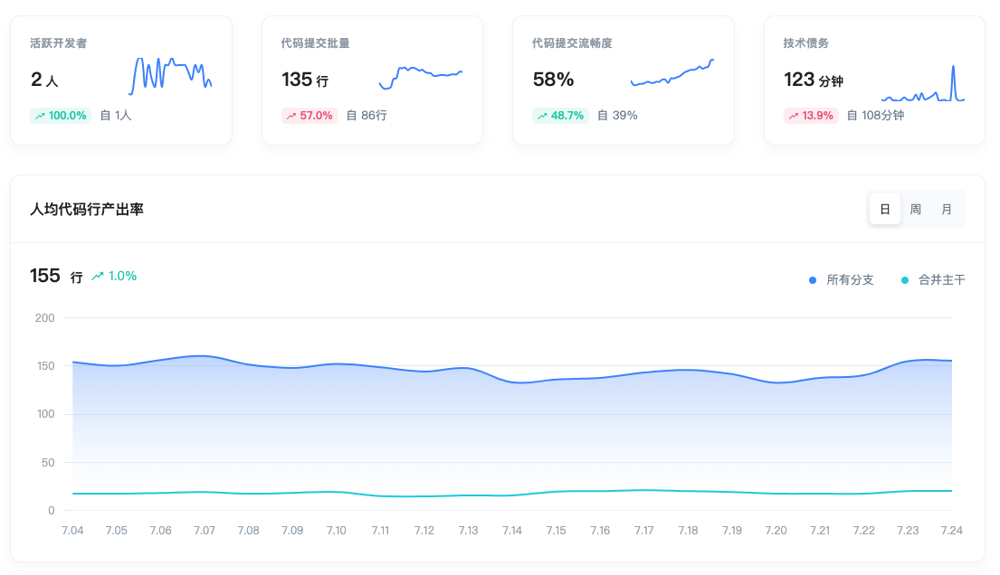

# 快速上手

> X-Developer 是 **研发全生命周期的数据管理与效能洞察平台**，我们基于在自动化和研发效能领域的技术能力与经验，完全自主创新、自主研发了这一平台。<br>X-Developer 致力为您提供 **理念领先行业、技术自主可控的新一代研发数据分析工具。**

## 主要功能

定位于研发数据平台，X-Developer 的主要功能是：向 Git 仓库及其它三方研发工具（如 Jira、SonarQube、Tempo Timesheet 等）自动化地完成数据采集，通过我们自主研发的效能分析引擎，为您生成研发管理、项目管理、工程管理、质量管理等多维度的指标和分析报表。



## 体验流程

X-Developer 提供“免费诊断”帮助您获得第一份研发效能分析报告。无论注册用户还是访客，均可以使用免费诊断功能。

!> 如果您是首次使用 X-Developer ，请确保您会操作 Git 命令行，用于生成执行数据分析的日志文件。

### 第一步：生成日志

进入待分析的 Git 仓库，运行如下命令：

```bash
git log --pretty=format:"%an,%ae,%ad,%s" >> commits.csv
```
### 第二步：使用日志进行分析

进入 [免费诊断](https://x-developer.cn/discovery/) 将您生成的日志 `commits.csv` 拖入文件区域，分析将自动启动。


根据日志文件的大小，您需要等待一至五分钟。


### 第三步：完成分析

分析完成后将看到查看按钮，点击即可查看诊断报告。


## 诊断报告

在这份报告中，X-Developer 向您展示了团队相关的指标和行业对比。


> 这只是免费体验的beta版本，我们会不断推出更多的免费体验报告指标。

## 行业指数

V2.0 版本，我们基于平台数据生成 [$X^d$ 指数](https://x-developer.cn/benchmark)，首批推出了交付周期时间、任务流畅度、提交活跃度、加班指数、深夜加班指数、BUGS & FIX 指数六大指标，供您进行对比。