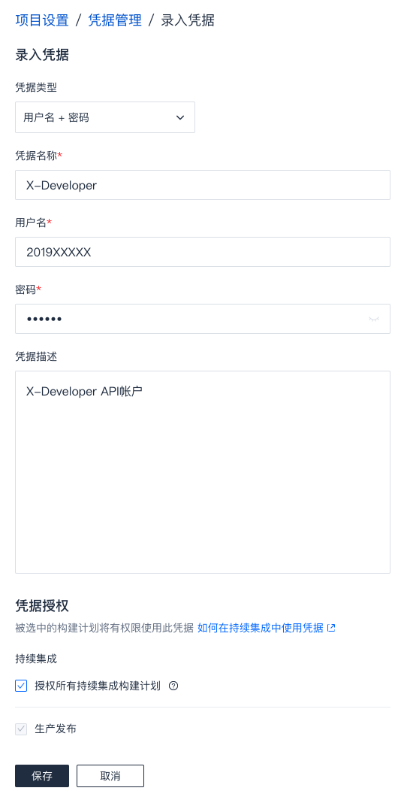
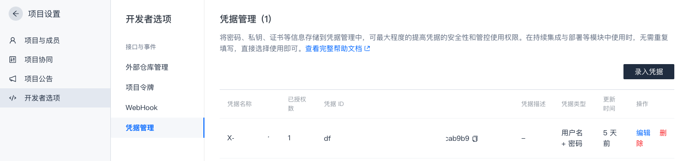
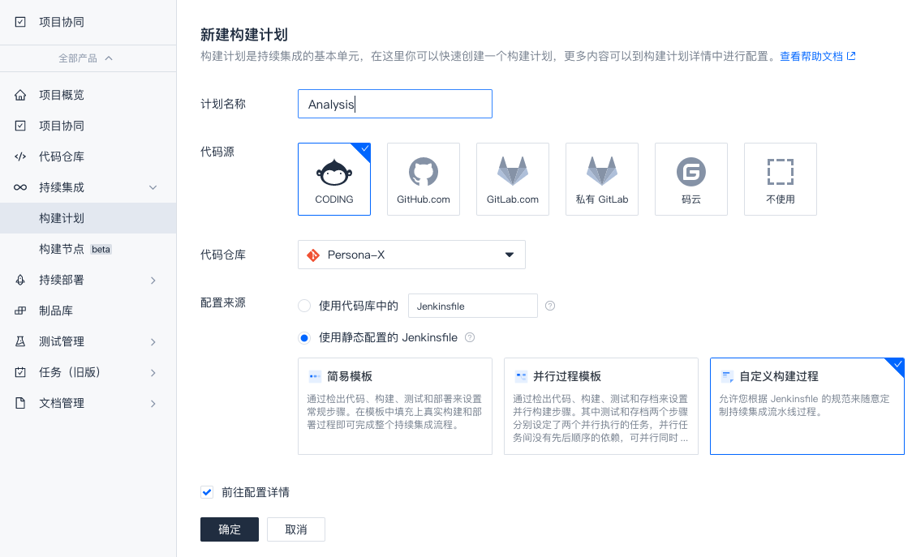
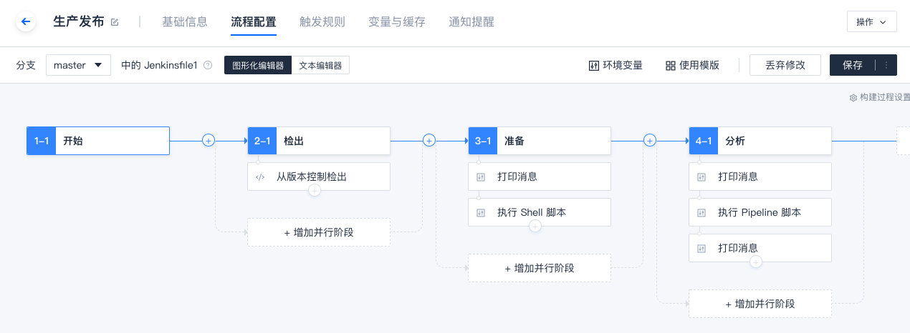
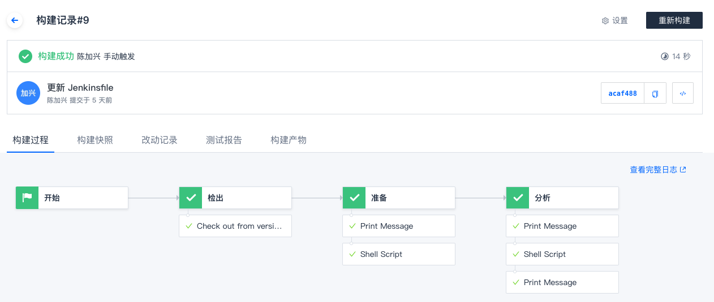
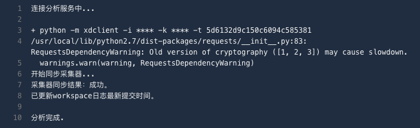

# Coding

Coding 是一款国产研发管理平台，提供了 Git 代码仓库和持续集成功能。您可以通过内置的持续集成 `Jenkinsfile` 与 X-Developer 实现连接，自动化地完成效能分析：

- 代码提交后自动同步 X-Developer 最新的仓库数量、将分析服务状态更新为待分析
- 每天 17:00 ~ 20:00，自动生成 GIT 日志并发送至 X-Developer 分析服务，运行分析
- 每次分析完成后，发送邮件通知到团队创建者

## 配置凭据

进入您的 Coding 项目，点击左侧菜单底部的“项目设置”，选择“开发者管理”——“凭据管理”，点击“录入凭据”。

选择凭据类型为“用户名+密码”，将您的 `APPID` 填写至用户名， `APPKEY` 填写至密码栏。因为需要在持续集成中使用，注意勾选下方的“授权所有持续集成构建计划”。



记录“凭据管理”下的凭据ID待用。



## 创建构建计划

进入项目左侧的持续集成菜单，新建一个构建计划，命名为 `Analysis`（命名无强制要求）。



Coding 将为您创建一个 `Jenkinsfile`，配置以下 `pipeline` 语句，环境变量中的 `TEAM` 为您创建的 X-Developer 团队的 `TEAMID`，credentialsId 为 “凭据管理”下的凭据ID。

```yaml
pipeline {
  agent any
  environment {
    TEAM = "5d6xxxx9c1xxx6094c5xxxxx" # 您需要连接的团队TEAMID
  }
  stages {
    stage('检出') {
      steps {
        checkout([
          $class: 'GitSCM',
          branches: [[name: env.GIT_BUILD_REF]],
          userRemoteConfigs: [[
            url: env.GIT_REPO_URL,
            credentialsId: env.CREDENTIALS_ID
          ]]])
        }
      }
      stage('准备') {
        steps {
          echo '安装分析组件中...'
          sh 'pip install xdclient'
        }
      }
      stage('分析') {
        steps {
          echo '连接分析服务中...'
          script {
            try {
              withCredentials([usernamePassword(credentialsId: 'xxx-xx-xx-xx-xx', usernameVariable: 'APPID', passwordVariable: 'APPKEY')]) {
                sh 'python -m xdclient -i ${APPID} -k ${APPKEY} -t ${TEAM}'
              }
            } catch(err) {
              echo err.getMessage()
            }
          }
          echo '分析完成.'
        }
      }
    }
  }
```

编辑完成后，图形化编辑器显示如下。



## 运行 pipeline

签入 `pipeline` 文件，将触发自动运行，成功后显示如下。



非分析时间段（每日17:00 ~ 20:00之外），X-Developer 将同步仓库最后更新时间。



## 查看分析结果

X-Developer 在每日 17:00 ~ 20:00 会启动分析，如果你希望立即运行分析，可以在命令行中指定 `-f True` 参数。

```yaml
stage('分析') {
    steps {
        echo '连接分析服务中...'
        script {
        try {
            withCredentials([usernamePassword(credentialsId: 'xxx-xx-xx-xx-xx', usernameVariable: 'APPID', passwordVariable: 'APPKEY')]) {
            sh 'python -m xdclient -i ${APPID} -k ${APPKEY} -t ${TEAM} -f True'
            }
        } catch(err) {
            echo err.getMessage()
        }
        }
        echo '分析完成.'
    }
}
```

分析成功的邮件将会自动发送到团队创建者邮箱中，点击立即查看即可查看到最新的报告。


