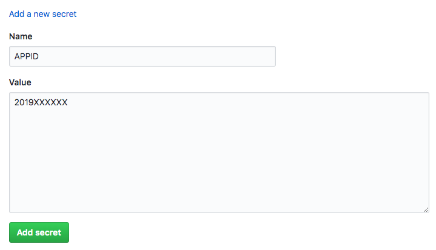
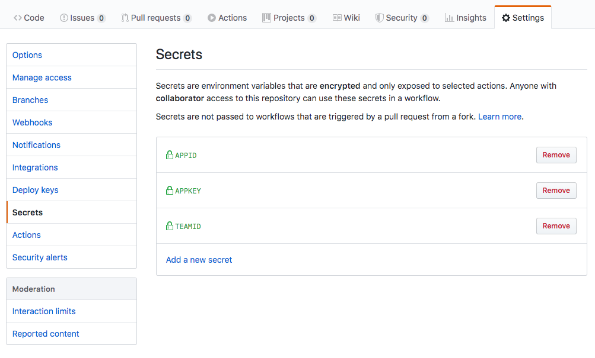
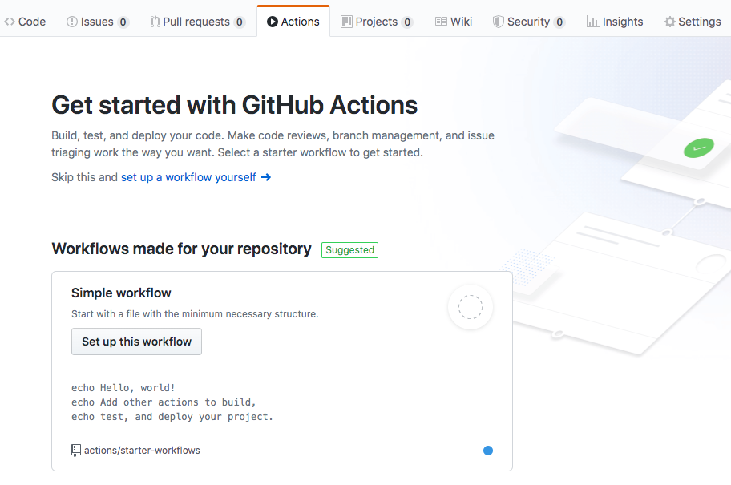
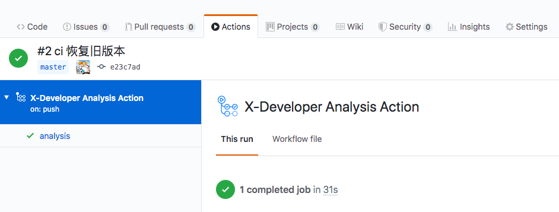
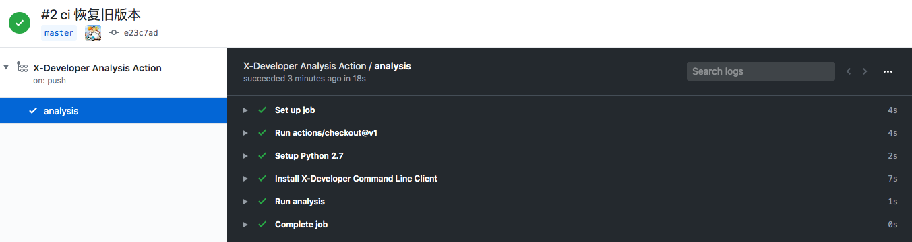
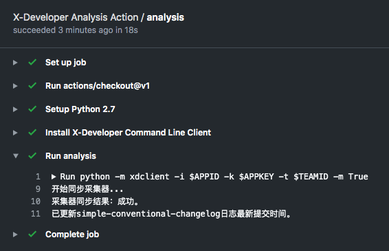
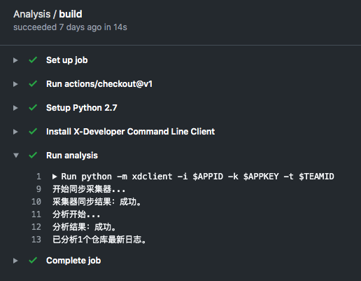
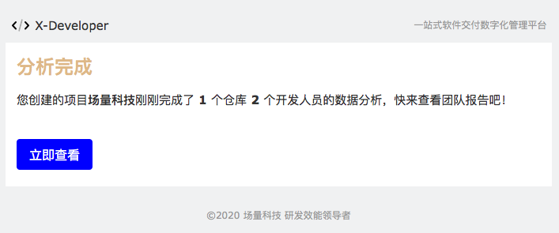

# GitHub

托管在 GitHub 的代码库，可通过 GitHub Secrets 和 [X-Developer Analysis Action](https://github.com/marketplace/actions/x-developer-analysis-action) 完成 X-Developer 接入，接入成功后无须人工干预，即可实现以下功能：

- 代码提交后自动同步 X-Developer 最新的仓库数量、将分析服务状态更新为待分析
- 每天 17:00 ~ 20:00，自动生成 GIT 日志并发送至 X-Developer 分析服务，运行分析
- 每次分析完成后，发送邮件通知到团队创建者

## 配置 Secrets

进入仓库 Settingt -> Secrets, 创建 `APPID` `APPKEY` `TEAMID` 并配置对应的值。

> 如果您使用 GitHub 组织，可以将 `APPID` `APPKEY` 配置在您的组织 `secrets` ，即可被所有仓库使用，以简化操作步骤。



配置完成后如下图所示。



## 配置 Action

在您的 GitHub 仓库菜单中点击 Actions 进入创建或配置页面。

### 创建 Action

使用默认的 Simple workflow ，点击 Set up this workflow ， 进入编辑界面。



### 开发分支配置

在开发分支上建立分析任务，用于帮助您近实时地管理团队日常开发活动，请配置 `workflow` 文件如下所示：

```yaml
on:
  push:
    branches: [ dev, test ]         # 非主干分支

jobs:
  analysis:
    runs-on: ubuntu-latest
    steps:
      - uses: actions/checkout@v1
      - name: X-Developer Analysis Action
        uses: FieldTech/x-developer-analysis-action@V1.2
        with:
          APPID: ${{ secrets.APPID }}
          APPKEY: ${{ secrets.APPKEY }}
          TEAMID: ${{ secrets.TEAMID }}
```

### 主干配置

如果您需要统计发布的需求、任务或Issues，以及如合并、发布等活动，请配置 `workflow` 文件如下所示：

```yaml
on:
  push:
    branches: [ master ]            # 主干分支

jobs:
  analysis:
    runs-on: ubuntu-latest
    steps:
      - uses: actions/checkout@v1
      - name: X-Developer Analysis Action
        uses: FieldTech/x-developer-analysis-action@V1.2
        with:
          APPID: ${{ secrets.APPID }}
          APPKEY: ${{ secrets.APPKEY }}
          TEAMID: ${{ secrets.TEAMID }}
          Master: True              # 将 Master 参数标记为 True
```

## 运行 Action

签入 Action 文件后 GitHub 会自动运行，成功会将出现以下界面。



点击左侧 analysis 查看输出步骤。



非分析时间段（每日17:00 ~ 20:00之外），X-Developer 将同步仓库最后更新时间。



## 查看分析结果

X-Developer 在每日 17:00 ~ 20:00 会启动分析，如果你希望立即运行分析，可以在配置中指定 `Force` 参数为 `True` 。

```yaml
on:
  push:
    branches: [ dev, test ]

jobs:
  analysis:
    runs-on: ubuntu-latest
    steps:
      - uses: actions/checkout@v1
      - name: X-Developer Analysis Action
        uses: FieldTech/x-developer-analysis-action@V1.2
        with:
          APPID: ${{ secrets.APPID }}
          APPKEY: ${{ secrets.APPKEY }}
          TEAMID: ${{ secrets.TEAMID }}
          Force: True              # 将 Force 参数标记为 True
```

在分析时间段，可以查看到执行分析的结果通知。



分析成功的邮件将会自动发送到团队创建者邮箱中，点击立即查看即可查看到最新的报告。

