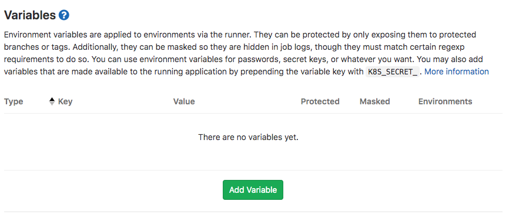
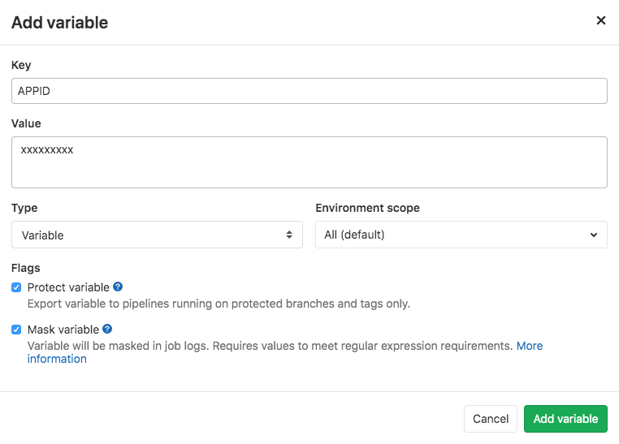
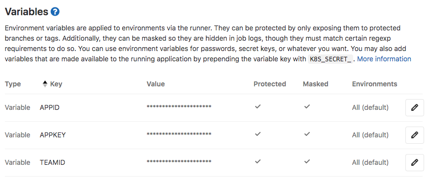
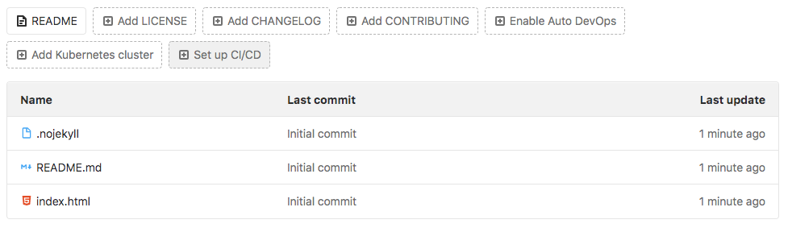
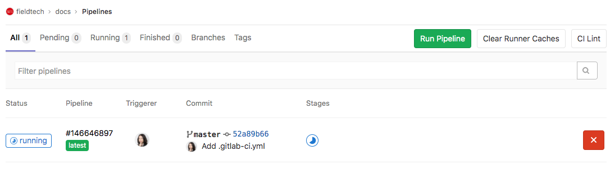
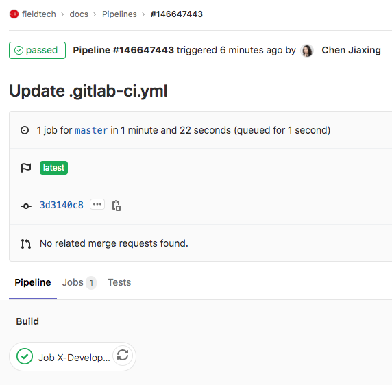
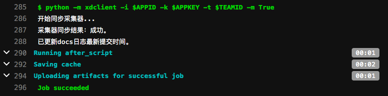
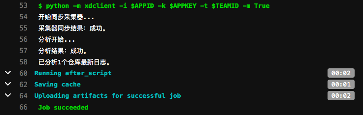

# GitLab

在 GitLab 上，通过环境变量和 GitLab CI，通过几行简单的脚本，即可实现 X-Developer 效能分析服务的集成。接入成功后无须人工干预，即可实现以下功能：

- 代码提交后自动同步 X-Developer 最新的仓库数量、将分析服务状态更新为待分析
- 每天 17:00 ~ 20:00，自动生成 GIT 日志并发送至 X-Developer 分析服务，运行分析
- 每次分析完成后，发送邮件通知到团队创建者

## 配置环境变量

进入您的项目 Settings -> CI/CD -> Variables



将你的 X-Developer APPID-KEY，创建项目的 TEAMID 添加到环境变量中：

- Type - 选择 Variable
- Environment scope - 选择 All
- 在 Flags 中勾选 Protect variable 和 Mask variable，以保护敏感数据



配置完成后如下图所示。



## 配置 CI 脚本

在项目首页点击 Set up CI/CD 按钮，进入 `.gitlab-ci.yml` 创建界面。



在编辑器中输入配置脚本：

```yaml
default:
  image: python:2.7
Job X-Developer Analysis:
  stage: build
  before_script:
    - pip install xdclient
  script: 
    - python -m xdclient -i $APPID -k $APPKEY -t $TEAMID -m True
```

!> GitLab CI 配置文件中通过 `-m True` 指定主干，如不配置，默认为 `False` ，即非主干分支。

签入之后，脚本将自动运行。

## 运行 CI 脚本

在 CI/CD 菜单的 `pipeline` 中可以看到流水线运行记录，成功的话会出现绿色的 `passed` 图标，点击图标查看构建任务细节。



点击最下方的 Job 名称，可查看输出日志。



非分析时间段（每日17:00 ~ 20:00之外），X-Developer 将同步仓库最后更新时间。



## 查看分析结果

X-Developer 在每日 17:00 ~ 20:00 会启动分析，如果你希望立即运行分析，可以在命令行中指定 `-f True` 参数。

```yaml
default:
  image: python:2.7
Job X-Developer Analysis:
  stage: build
  before_script:
    - pip install xdclient
  script: 
    - python -m xdclient -i $APPID -k $APPKEY -t $TEAMID -f True
```

以下是分析成功的日志展示：



分析成功的邮件将会自动发送到团队创建者邮箱中，点击立即查看即可查看到最新的报告。

