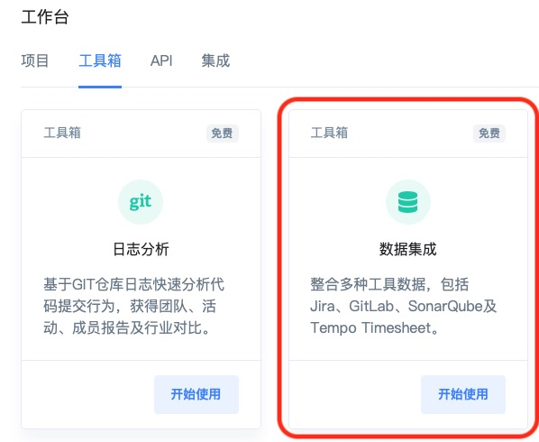
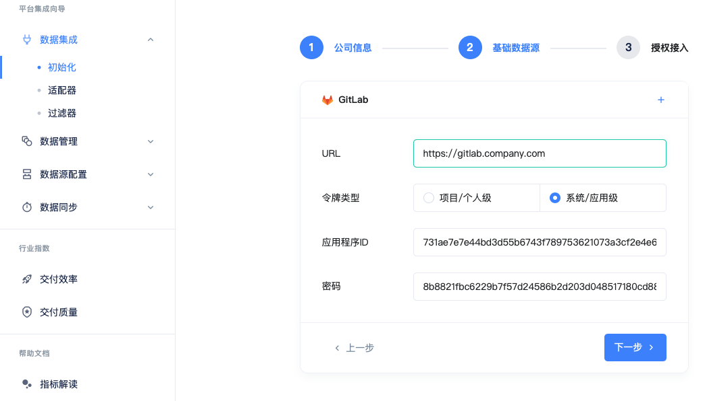
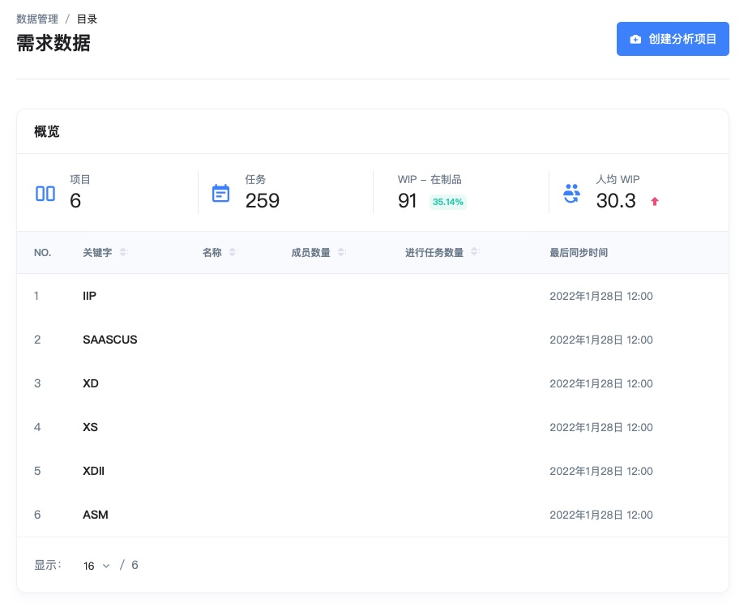
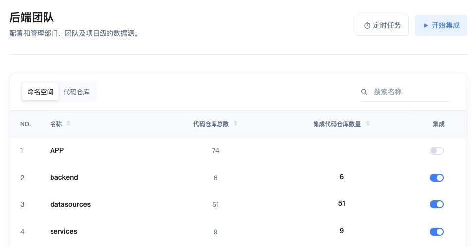

# 数据集成

X-Developer 3.0 在 2.0 工具集成的基础上，推出了全新的 **一体化集成向导，**通过完全配置化、自动化的方式，您可以轻松地将数据整合到一起，并设置自定义的过滤器规则，进一步筛选数据范围，构建灵活强大的分析项目。

> 数据集成工具已全面在线开放，每位用户可享受 **30 天免费体验。**

您可以通过首页的 **工具/研发工具集成** 菜单或工作台中的 **工具箱** 菜单找到数据集成入口。

## 初始化

进入 [平台集成向导](https://x-developer.cn/integration/guide/initial)，每位用户可以设定自己的组织名称，选择一款研发工具提供基础数据（如项目、仓库名称），默认的工具为 GitLab。在数据集成之前，X-Developer 需要获得工具授权，您可以在 GitLab 创建系统或用户凭证，填写之后根据提示完成授权（用户级/项目级无须二次校验）。

初始化配置完成之后，X-Developer 将自动启动基础数据同步（项目、仓库），出于隐私保护，您需要手动执行用户数据的同步。

## 适配器

X-Developer 的适配器（Adapters）用于管理与研发工具的授权凭证与数据请求API。我们已经支持 Jira、GitLab、Jenkins、SonarQube 等主流的研发工具与多个版本。

所有的配置都可以通过界面完成，除初始数据的提供工具，您可以根据需要随时停止和开启数据集成任务。

## 过滤器

X-Developer 的过滤器（Filters）是一组可自定义和层级继承的规则，通过界面化的开关操作，您可以基于命名空间、仓库、项目来筛选分析项目的采集范围。

在有多个部门与层级关系的组织中，过滤器及规则复用可以帮助您快速地部署数据采集规则，实现灵活的数据采集管理。

> 付费功能：过滤器功能未向免费用户开放。

## 数据目录

基础的数据目录为用户，根据数据源工具的不同，数据目录包括项目（来自需求及项目、任务管理工具）、仓库（来自代码版本管理工具）及缺陷（来自质量及静态扫描工具）等。

我们为每个数据目录提供了摘要信息，方便您进行统计和检视。

## 数据源

X-Developer 的数据源（Data Sources）是为每一个分析项目指定的数据范围，默认加载分析项目父级的过滤器规则，您可以在父级规则之下进一步调整范围，精确地筛选项目或仓库。

第一次配置之后，点击“开始集成”可以运行分析，查看报告。

## 同步任务

分析项目创建完成之后，X-Developer 平台自动为每个项目创建出一组定时任务，包括数据的同步、指标计算与报告生成，在任务界面，您可以手动触发，并查看执行结果。
