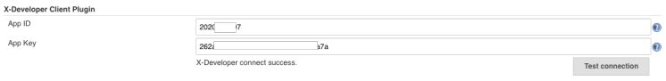
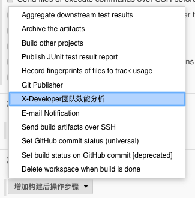
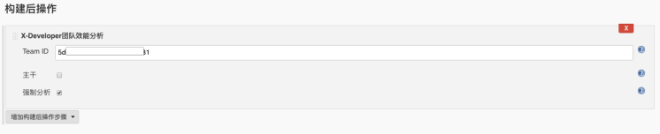

# Jenkins

如果您使用 Jenkins 来完成持续集成工作，可通过安装配置 X-Developer Client Jenkins Plugin 完成集成。接入成功后无须人工干预，即可实现以下功能：

- 代码提交后自动同步 X-Developer 最新的仓库数量、将分析服务状态更新为待分析
- 每天 17:00 ~ 20:00，自动生成 GIT 日志并发送至 X-Developer 分析服务，运行分析
- 每次分析完成后，发送邮件通知到团队创建者

[下载 X-Developer Jenkins 插件](https://x-developer.cn/static/client/x-developer-client-1.0.hpi)（后缀名为.hpi）

!> X-Developer Client Plugin 正在社区发布中，如果您通过我们的网站下载使用了此插件，建议后续在 Jenkins 插件中心升级最新版本。

## 安装配置插件

### 插件安装

进入Jenkins管理界面-->管理插件-->高级，上传插件界面中，选择您下载的插件文件，上传后将自动安装，无须重新启动。

### 配置账户

进入Jenkins管理界面，您将看到 X-Developer Client Plugin 配置项，填写 APP ID 和 APP KEY，点击 Test connection，如果正确将返回“X-Developer 认证成功”。

## 配置流水线

在团队的构建流水线上，添加“构建后操作”，选择 X-Developer 团队效能分析。

填写 TEAM ID，展开高级选项（可选）：

- 如果此构建任务是主干分支，请勾选“主干”；如果是开发测试分支，此项请勿勾选。
- 如果您需要每次构建后都执行分析，请勾选“强制分析”。默认情况下，X-Developer 每天 17:00 ~ 20:00 执行分析任务。

## 运行流水线

每次 Jenkins 完成构建任务后，会触发 X-Developer Client 并执行数据传输和分析任务，执行结果将会打印在构建日志中。

## 查看分析结果

X-Developer 在每日 17:00 ~ 20:00 会启动分析，如果你希望立即运行分析，可以在流水线“X-Developer 团队效能分析”高级设置中勾选“强制分析”。

分析成功的邮件将会自动发送到团队创建者邮箱中，点击立即查看即可查看到最新的报告。

