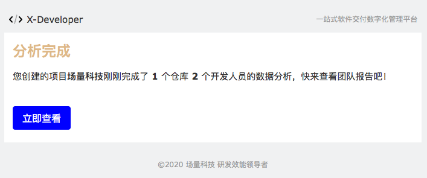

# TravisCI

如果您使用 TravisCI 来完成持续集成工作，可直接调用 X-Developer 提供的 [xdclient](https://pypi.org/project/xdclient/) 模块通过 `.travis.yml` 完成命令行集成。接入成功后无须人工干预，即可实现以下功能：

- 代码提交后自动同步 X-Developer 最新的仓库数量、将分析服务状态更新为待分析
- 每天 17:00 ~ 20:00，自动生成 GIT 日志并发送至 X-Developer 分析服务，运行分析
- 每次分析完成后，发送邮件通知到团队创建者

## 配置环境变量

进入您的 TravisCI 项目设置，到环境变量配置部分。添加 `APPID` `APPKEY` 和 `TEAMID`，保持 `DISPLAY VALUE IN BUILD LOG` 处于关闭状态。


配置完成如下所示：


## 配置 travis.yml

在 Jobs 下新增 analysis stage，如下所示：

```yaml
jobs:
  include:
    - stage: analysis
      language: python
      python:
        - 2.7.16
      before_install:
        - pip install xdclient
      script:
        - python -m xdclient -i $APPID -k $APPKEY -t $TEAMID
```

## 运行 Job

下一次提交代码时，即会触发 X-Developer 分析服务并查看到分析结果，如下 analysis 节点所示：


点击 `analysis` 可查看输出详情。


## 查看分析结果

X-Developer 在每日 17:00 ~ 20:00 会启动分析，如果你希望立即运行分析，可以在命令行中指定 `-f True` 参数。

```yaml
jobs:
  include:
    - stage: analysis
      language: python
      python:
        - 2.7.16
      before_install:
        - pip install xdclient
      script:
        - python -m xdclient -i $APPID -k $APPKEY -t $TEAMID -f True
```

分析成功的邮件将会自动发送到团队创建者邮箱中，点击立即查看即可查看到最新的报告。

