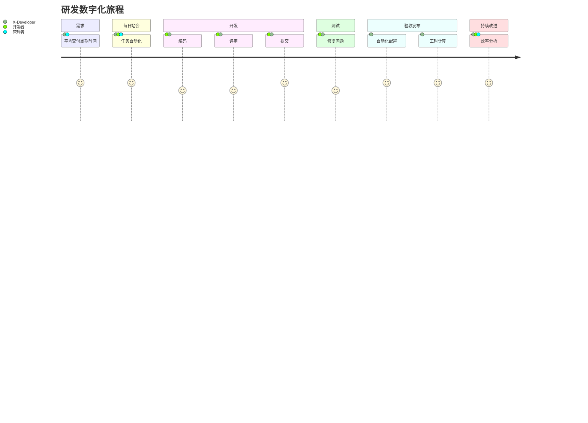

# X-Developer

> 人机协作时代的研发管理利器 :rocket::rocket::rocket:

数字化企业时代，越来越多的内部流程、活动将由人工协同转为自动化流转，软件研发由局部的 CI/CD 工具实施转入全面的 DevOps 开发运维一体化。管理的挑战，已经不止于人与人之间的高效协同，而是人与机器的自动化协同。

X-Developer 作为全球第一款事实数据型研发效能平台，我们首推国内领先的 **流程-度量-绩效** 闭环的解决方案，帮助企业提升研发管理的数字化能力。

## 功能特点

基于对研发活动、过程的洞察与不断优化，X-Developer 为研发团队打造了产品、开源工具解决方案系列，帮助研发团队构建更加精益和高效的数字化旅程。

- **将管理活动自动化与数据化，**为下一代智能化研发提供基础工具与数据支撑
- **降低开发者的任务维护成本，**提升研发过程中的增值时间与流动效率
- **增强管理者对研发一线的现场管理能力，**及时发现问题、分析差距并归因溯源，从而改善研发绩效管理水平

## 如何实现

### 构建面向未来的开发流程

X-Developer `Workflow` 充分整合了业界最佳实践与工具，围绕开发流程提供了完整的数字化方案，帮助您规范化代码提交流程，并自动更新任务状态，生成能够快速完成部署、发布与度量分析的日志数据。

- Git 代码仓库管理规范：比 `git-flow` 更优化、更稳定的提交流程，适用于持续交付的最佳实践
- Git 代码提交工具：对开源规范 `conventional commits 1.0` 进行简化，更适合于企业级团队协作
- 自动化看板：基于精益价值流对任务状态自动更新，减少开发团队的维护工作量
- 数据驱动：基于历史数据实时计算交付周期时间与变化趋势，帮助管理层更好地评估产能和效率基准

### 基于事实的研发度量体系

X-Developer `Insights` 通过对 Git 仓库日志的自动化采集，并基于机器学习、统计分析技术，与精益管理思想，形成了一套无须人工干预、实时化的研发效能度量解决方案，并提供了对主流工具的全面集成，支持开源组织、企业轻松便捷地实现研发度量。

- 支持主流的 Git 仓库：仅需简单的配置，即可完成对 GitHub、GitLab、Coding.net 等主流平台集成，代码提交即可自动化采集日志
- 支持主流的 CI 工具：仅需简单的配置安装，即可完成对 Jenkins、TravisCI 等主流平台集成，在流水线中自动化触发日志采集任务

### 提升基层的研发绩效水平

X-Developer `Dashboards` 提供了产品、项目、团队、人员多种维度的可视化报告，其中包括项目管理、敏捷、精益等多种管理模式下的100多个统计分析指标，以及开发者行为分析，帮助管理层全方位地洞察一线研发活动，量化差距，提升绩效水平。

## 领先水平

X-Developer 的背后凝聚着我们**在研发效能领域十多年对多家世界500强企业、创新科技型公司以及开源组织，包括通信、银行、保险、电力、能源、软件服务等多个领域的咨询分析经验积累与洞察，**它由我们完全自主研发，并拥有全部知识产权，包括三项发明专利、两项外观专利和八项软件著作权。

X-Developer 带给您的不止是一款工具，我们将帮助您的组织持续地获得研发效能与自动化领域的趋势洞察，始终保持领先的研发生产力水平。