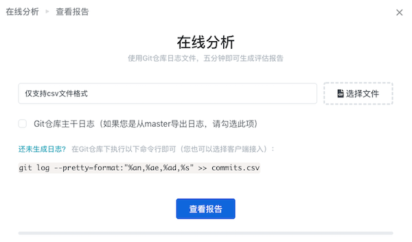

# 分析项目

X-Developer 每一个分析项目都是一个效能管理单元——独立地收集与分析数据。您可以为部门、团队、项目组创建不同的分析项目，或者一个需要进行数月的专题开发创建独立的分析项目。

最简单的开始，就是为一个小团队创建一个分析项目，然后把他们的 GIT 仓库都集成到该分析项目中。

!> 只有试用用户和付费会员有创建分析项目的权限。想了解如何试用？请查看 [申请企业试用](/?id=_1-企业试用)。

## 创建团队

开通权限后，在工作台上您可以看到创建团队的提示。

点击创建团队，填写团队名称和描述。

### 起始时间设置

起始时间是指截取 GIT 仓库日志数据的开始时间，请保证此时间早于您提供的日志时间。

比如说，您提供的日志是 2020 年的，如要设置起始时间，至少要设置为 2020年1月1日。

!> 建议：如无必要，第一次使用时**请将此项置空**。许多用户误将此日期设置为“今天”，导致获取不到日志数据，而无法正确生成分析报告。

## 在线分析

首次操作，我们推荐您使用在线分析功能，以快速查看报告。您可以同时导出多个 GIT 仓库的日志一起上传，X-Developer 将自动完成日志的清洗和合并。

进入项目界面，将看到下面的提示。

点击“手动运行”，即可进入日志上传界面。

选择生成的日志文件，点击“运行”，分析即刻开始。

## 分析完成

完成后您将看到效能分析报告，在工作台上也能够看到项目卡片上出现了对应的统计数字。

